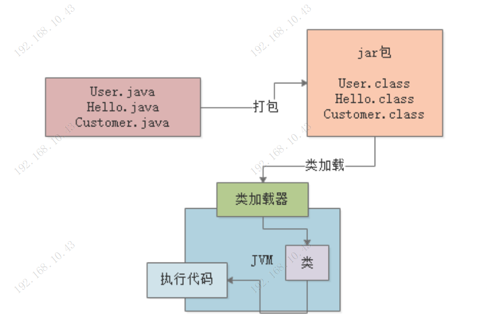

#### **我们平时写的Java代码，到底是怎么运行起来的？**

> 1. 我们写好的“.java”代码文件在打包过程中，一般就会把代码***编译***成“.class”后缀的字节码文件。
> 2. 我们打的jar包或者war包运行时，会启动一个jvm
> 3. 此时会采用***类加载器***把编译好的那些“.class”字节码文件给加载到JVM中，然后供后续代码运行来使用。
> 4. 最后一步，JVM就会基于自己的***字节码执行引擎***，来执行加载到内存里的我们写好的那些类了。比如你的代码中有一个“main()”方法，那么JVM就会从这个“main()”方法开始执行里面的代码。他需要哪个类的时候，就会使用类加载器来加载对应的类。

