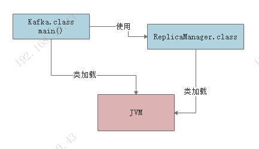
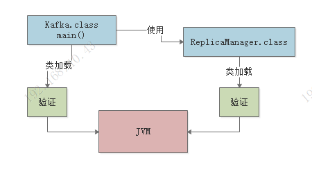
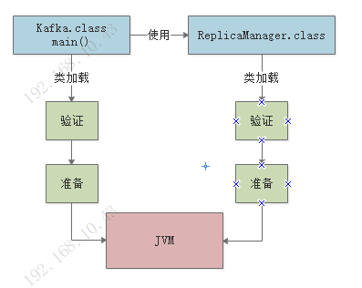
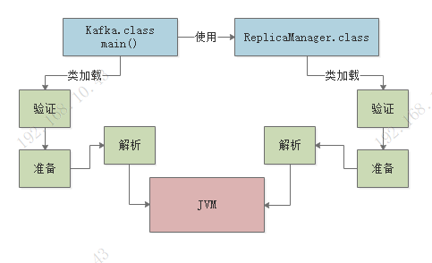
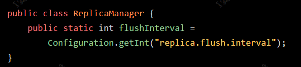
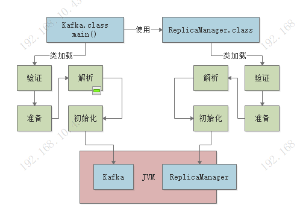
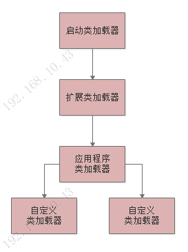
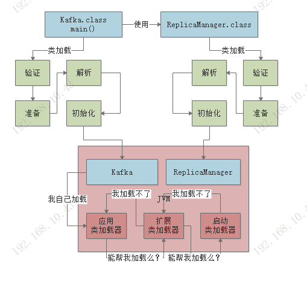

### 一、类加载的几个过程

> **加载 -> 验证 -> 准备 -> 解析 -> 初始化 -> 使用 -> 卸载**

##### 1.加载

- 代码中用到某个类的时候，就会将".class"字节码文件中加载这个类到jvm内存中。

- 例如Test.class中有一个"main()"方法作为主入口,那么JVM进程启动之后，会把Test.class加载到内存中，然后从"main()"方法的入口开始执行，在"main()"方法中如果用到其他类，则再去从字节码文件中加载别的类。

##### 2.验证

- 这一步就是根据Java虚拟机规范，来校验你加载进来的“.class”文件中的内容，是否符合指定的规范。

- 假如说，你的“.class”文件被人篡改了，里面的字节码压根儿不符合规范，那么JVM是没法去执行这个字节码的。

  

##### 3.准备

- 在加载、验证阶段完成后，接着就会进行准备工作。
- 首先给加载的类分配内存空间，然后给里面的类变量（也就是static修饰的变量）分配内存空间，来一个默认的初始值。

##### 4.解析

- 这个阶段实际上是把**符号引用替换为直接引用**的过程，其实这个部分的内容很复杂，涉及到JVM的底层。

  

##### 5.初始化（核心阶段）

- 如上图所示，准备阶段时，仅仅是给“flushInterval”类变量开辟一个内存空间，然后给个初始值“0”罢了。

- 初始化阶段就会执行类的初始化代码，比如上面的 Configuration.getInt("replica.flush.interval") 代码就会在这里执行，完成一个配置项的读取，然后赋值给这个类变量“flushInterval”。

- static静态代码块也会在初始化阶段执行。

- 如果初始化一个类的时候，发现他的父类还没有初始化，那么必须先初始化他的父类。

  

***

### 二、类加载器和双亲委派机制

> 上面讲了类加载从触发时机到初始化的过程，接着给大家说一下类加载器的概念。

#### 1.类加载器

1. 启动类加载器
   - **Bootstrap ClassLoader**
   - 主要是负责加载我们在机器上安装的Java目录下的核心类
   - Java安装目录下，有一个“**lib**”目录，这里就有Java最核心的一些类库，支撑你的Java系统的运行。
   - 一旦JVM启动，那么首先就会依托启动类加载器，去加载你的Java安装目录下的“lib”目录中的核心类库。
2. 扩展类加载器
   - **Extension ClassLoader**
   - 加载Java安装目录下，有一个“lib\ext”目录下的类库，支撑你的系统的运行。
3. 应用程序类加载器
   - **Application ClassLoader**
   - 负责去加载“ClassPath”环境变量所指定的路径中的类。
   - 这个类加载器就负责加载你写好的那些类到内存里。
4. 自定义类加载器
   - 除了上面那几种之外，还可以自定义类加载器，去根据你自己的需求加载你的类。

#### 2.双亲委派机制

- JVM的类加载器是有亲子层级结构的，就是说启动类加载器是最上层的，扩展类加载器在第二层，第三层是应用程序类加载器，最后一层是自定义类加载器

  

- 基于这个亲子结构，就有了双亲委派的加载机制。

- **双亲委派机制：**

  - 假设你的应用程序类加载器需要加载一个类，他首先会委派给自己的父类加载器去加载，最终传导到顶层的类加载器去加载

  - 但是如果父类加载器在自己负责加载的范围内，没找到这个类，那么就会下推加载权利给自己的子类加载器。

    

