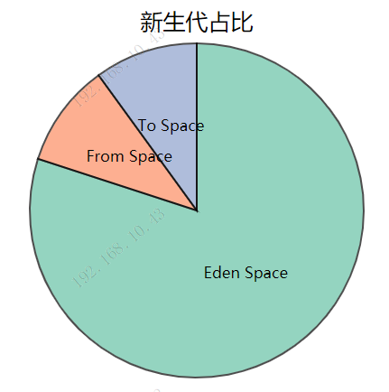

> JVM运行时数据区分为：线程私有（虚拟机栈、本地方法栈、程序计数器），线程共享（堆、元空间（方法区））

### 1.虚拟机栈

- 描述的是java方法执行的内存模型，每次方法的调用数据都是通过栈传递的。
- 存储一些方法的局部变量表（基本类型、对象引用）、操作数栈、动态链接、方法出口等信息。
- 每个虚拟机线程都有一个私有的栈，一个线程的java栈在线程创建时创建。
- 每个方法执行的同时都会创建一个栈帧，每个方法被调用直至完成的过程，就对应着一个栈帧在虚拟机中从入栈到出栈的过程。
- 若java虚拟机栈的内存大小不允许动态扩展时，当线程请求的栈深度大于虚拟机允许的栈深度是报StackOverFlowError异常。
- 若java虚拟机栈的内存大小允许动态扩展，当栈的扩展无法申请到足够的内存时报OutOfMemeoryError异常。

### 2.本地方法栈

- 和虚拟机栈发挥的作用非常相似，区别是虚拟机栈为虚拟机执行java方法服务，本地方法栈为虚拟机使用Native方法服务。
- 有时java需要调用操作系统的一些方法，而操作系统基本都是C语言写的，这时就需要使用到Native方法了。
- Native方法关键字修饰的方法是一个原生态的方法，方法对应的实现不是在当前文件，而是在用其他语言（如C和C++）实现的文件中。java语言本身不能对操作系统底层进行访问和操作，但是可以通过JNI（Java Native Interface）接口调用其他语言来实现对底层的访问。
- 也会出现StackOverFlowError和OutOfMemeoryError异常。

### 3.程序计数器

- 依次读取指令，从而实现代码的流程控制。
- 在多线程的情况下，程序计数器用于记录当前线程执行的位置。
- 程序计数器是唯一一个不会出现OutOfMemoryError的内存区域，它的生命周期随着线程的创建而创建，随着线程的结束而死亡。

### 4.堆内存

- 堆是java虚拟机中所管理的内存中最大的一块，java堆是所有线程共享的一块内存区域，在虚拟机启动时创建。

- java堆的唯一目的就是存放对象实例，几乎所有的对象实例以及数组都是在这里分配内存。

- java堆是垃圾回收器的主要工作区域。java推还可以分为新生代、老年代。但是垃圾回收器的永久代是在方法区中的，不在堆中（新生代：新建的对象由新生代分配内存；老年代：存放经过多次垃圾回收器回收仍然存活的对象；永久代：存放静态文件，如java类、方法等，永久代存放在方法区，对垃圾回收没有显著的影响）

  1. 新生代

     - Eden Space + From Space +  To Space (8:1:1)

     

     - 一般情况下，新创建的对象都会被分配到Eden区(一些大对象特殊处理),这些对象经过第一次Minor GC后，如果仍然存活，将会被移到Survivor区。对象在Survivor区中每熬过一次Minor GC，年龄就会增加1岁，当它的年龄增加到一定程度时，就会被移动到年老代中。
     - 因为年轻代中的对象基本都是朝生夕死的(80%以上)，所以在年轻代的垃圾回收算法使用的是复制算法，复制算法的基本思想就是将内存分为两块，每次只用其中一块，当这一块内存用完，就将还活着的对象复制到另外一块上面。复制算法不会产生内存碎片。
     - 判断对象是否存活算法：
       1. 引用计数算法：早期判断对象是否存活大多都是以这种算法，这种算法判断很简单，简单来说就是给对象添加一个引用计数器，每当对象被引用一次就加1，引用失效时就减1。当为0的时候就判断对象不会再被引用。
          - 优点：实现简单效率高，被广泛使用与如python何游戏脚本语言上。
          - 缺点：难以解决循环引用的问题，就是假如两个对象互相引用已经不会再被其它其它引用，导致一直不会为0就无法进行回收。
       2. 可达性分析算法：目前主流的商用语言[如java、c#]采用的是可达性分析算法判断对象是否存活。这个算法有效解决了循环利用的弊端。
          - 它的基本思路是通过一个称为“GC Roots”的对象为起始点，搜索所经过的路径称为引用链，当一个对象到GC Roots没有任何引用跟它连接则证明对象是不可用的。
     - Minor GC:
       1. 在GC开始的时候，对象只会存在于Eden区和名为“From”的Survivor区，Survivor区“To”是空的。
       2. 紧接着进行GC，Eden区中所有存活的对象都会被复制到“To”，而在“From”区中，仍存活的对象会根据他们的年龄值来决定去向。年龄达到一定值(年龄阈值，可以通过-XX:MaxTenuringThreshold来设置)的对象会被移动到年老代中，没有达到阈值的对象会被复制到“To”区域。（动态判断对象的年龄。如果Survivor区中相同年龄的所有对象大小的总和大于Survivor空间的一半，年龄大于或等于该年龄的对象可以直接进入老年代。）
       3. 经过这次GC后，Eden区和From区已经被清空。这个时候，“From”和“To”会交换他们的角色，也就是新的“To”就是上次GC前的“From”，新的“From”就是上次GC前的“To”。不管怎样，都会保证名为To的Survivor区域是空的。Minor GC会一直重复这样的过程，直到“To”区被填满，“To”区被填满之后，会将所有对象移动到年老代中。
     - GC可分为三种：Minor GC Major GC 和 Full GC
       1. Minor GC ：是清理新生代。触发条件：当Eden区满时，触发Minor GC。
       2. Major GC：是清理老年代。是Major GC还是Full GC，大家应该关注当前的GC是否停止了所有应用程序的线程，还是能够并发的处理而不用停掉应用程序的线程。
       3. Full GC ：是清理整个堆空间—包括年轻代和老年代。触发条件：
          - 调用System.gc时，系统建议执行Full GC，但是不必然执行;
          - 老年代空间不足;
          - 方法区空间不足；
          - 通过Minor GC后进入老年代的平均大小大于老年代的可用内存；
          - 由Eden区、From Space区向To Space区复制时，对象大小大于To Space可用内存，则把该对象转存到老年代，且老年代的可用内存小于该对象大小 

  2. 老年代

     - 主要存放应用程序中生命周期长的内存对象
     - 老年代的对象比较稳定，所以MajorGC不会频繁执行。在进行MajorGC前一般都先进行了一次MinorGC，使得有新生代的对象晋身入老年代，导致空间不够用时才触发。当无法找到足够大的连续空间分配给新创建的较大对象时也会提前触发一次MajorGC进行垃圾回收腾出空间。
     - MajorGC采用标记—清除算法：首先扫描一次所有老年代，标记出存活的对象，然后回收没有标记的对象。MajorGC的耗时比较长，因为要扫描再回收。
     - MajorGC会产生内存碎片，为了减少内存损耗，我们一般需要进行合并或者标记出来方便下次直接分配。
     - 当老年代也满了装不下的时候，就会抛出OOM（Out of Memory）异常。

### 5.元空间（方法区）

- 所有线程共享
- 用于存储已被虚拟机加载的类信息、常量、静态变量、即时编译器编译后的代码等数据。
- 当方法区无法满足内存的分配需求时，报OutOfMemoryError异常
- 方法区中有一个运行时常量池，用于存储编译期生成的各种字面量与符号引用，当常量池无法再申请到内存时报OutOfMemoryError异常。