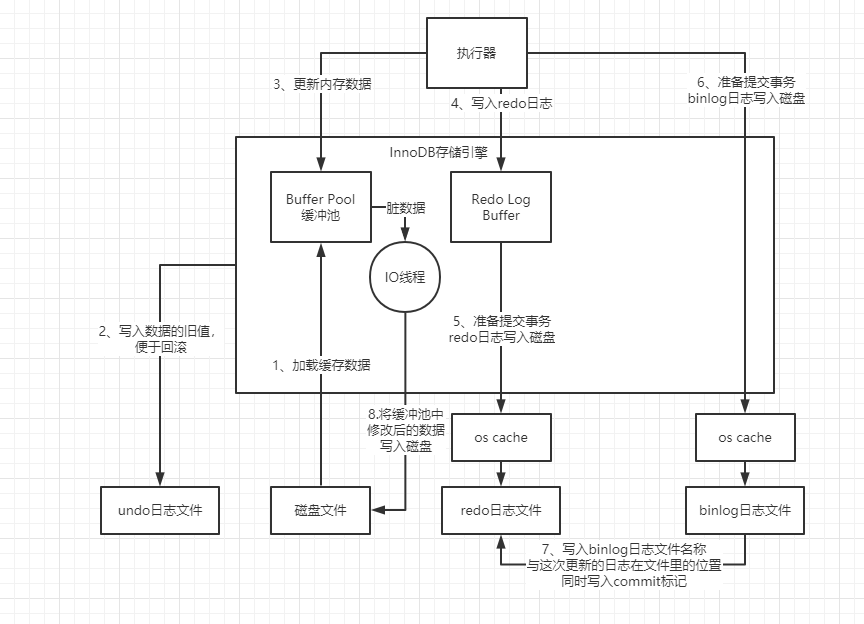

假设我们有一条SQL语句是这样的：

update users set name='xxx' where id=10

#### InnoDB的执行步骤如下：

## 一、基本组件

**1.InnoDB的重要内存结构：缓冲池**

InnoDB存储引擎中有一个非常重要的放在内存里的组件，就是缓冲池（Buffer Pool），这里面会缓存很多的数据，以便于以后在查询的时候，万一你要是内存缓冲池里有数据，就可以不用去查磁盘了

引擎要执行更新语句的时候 ，比如对“id=10”这一行数据，他其实会先将“id=10”这一行数据看看是否在缓冲池里，如果不在的话，那么会直接从磁盘里加载到缓冲池里来，而且接着还会对这行记录加独占锁。

**2.undo日志文件**

如果我们执行一个更新语句，要是他是在一个事务里的话，那么事务提交之前我们都是可以对数据进行回滚的，也就是把你更新为“xxx”的值回滚到之前的“zhangsan”去。所以为了考虑到未来可能要回滚数据的需要，这里会把你更新前的值写入undo日志文件

**3.Redo Log Buffer**

所谓的redo日志，就是记录下来你对数据做了什么修改，比如对“id=10这行记录修改了name字段的值为xxx”，这就是一个日志。

**4.Redo日志文件**

我们想要提交一个事务了，此时就会根据一定的策略把redo日志从redo log buffer里刷入到Redo磁盘文件里去。

写入Redo磁盘的策略：通过**innodb_flush_log_at_trx_commit**进行配置（通常建议设置为1）

	1. 这个参数的值为0的时候，提交事务的时候，不会把redo log buffer里的数据刷入磁盘文件
	2. 这个参数的值为1的时候，提交事务的时候，就必须把redo log从内存刷入到磁盘文件里去，只要事务提交成功，那么redo log就必然在磁盘里
	3. 这个参数的值为2的时候，提交事务的时候，把redo日志写入磁盘文件对应的os cache缓存里去，而不是直接进入磁盘文件，可能1秒后才会把os cache里的数据写入到磁盘文件里去。

**5.binlog日志文件**

1. 我们之前说的redo log，他是一种偏向物理性质的重做日志，因为他里面记录的是类似这样的东西，“对哪个数据页中的什么记录，做了个什么修改”，redo log本身是属于InnoDB存储引擎特有的一个东西
2. 而binlog叫做归档日志，他里面记录的是偏向于逻辑性的日志，类似于“对users表中的id=10的一行数据做了更新操作，更新以后的值是什么”，binlog不是InnoDB存储引擎特有的日志文件，是属于mysql server自己的日志文件。
3. 对于binlog日志，其实也有不同的刷盘策略，有一个**sync_binlog**参数可以控制binlog的刷盘策略，他的默认值是0
   1. 默认值是0：把binlog写入磁盘的时候，其实不是直接进入磁盘文件，而是进入os cache内存缓存。
   2. 把**sync_binlog**参数设置为1：此时会强制在提交事务的时候，把binlog直接写入到磁盘文件里去，那么这样提交事务之后，哪怕机器宕机，磁盘上的binlog是不会丢失的。

## 二、系统宕机怎么保证数据一致性

#### 三个阶段：

- 1、2、3、4四个步骤，其实本质是你执行这个更新语句的时候干的事

- 5、6、7三个步骤，是提交事务的阶段

- 8这个步骤，是缓存回写磁盘的阶段

  ##### 步骤1、2、3、4执行过程中，系统宕机

  	1. 没提交事务，就代表他没执行成功，此时MySQL宕机虽然导致内存里的数据都丢失了，但是你会发现，磁盘上的数据依然还停留在原样子。
  	2. 也就是说，“id=1”的那行数据的name字段的值还是老的值，“zhangsan”，所以此时你的这个事务就是执行失败了，没能成功完成更新，你会收到一个数据库的异常。然后当mysql重启之后，你会发现你的数据并没有任何变化。

  ##### 步骤5、6执行过程中，系统宕机

  1. 步骤5、6、7必须是三个步骤都执行完毕，才算是提交了事务，那么在我们刚完成步骤5的时候，也就是redo log刚刷入磁盘文件的时候，mysql宕机了，这个时候因为没有最终的事务commit标记在redo日志里，所以此次事务可以判定为不成功。
  2. 最后在redo日志中写入commit标记的意义是用来保持redo log日志与binlog日志一致的。

  ##### 步骤7执行结束，系统宕机

  1. **innodb_flush_log_at_trx_commit**设置为1，你提交事务的时候，就必须把redo log从内存刷入到磁盘文件里去，只要事务提交成功，那么redo log就必然在磁盘里。
  2. mysql重启之后，他可以根据redo日志去恢复之前做过的修改。
  3. **innodb_flush_log_at_trx_commit**如果设置为2，就可能导致redo日志没有从os cache缓存写入磁盘盘，导致内存里的redo日志丢失，你提交的事务更新的数据就丢失了。

  ##### 步骤8

  1. 步骤5、6、7执行成功后，代表事务提交成功。MySQL有一个后台的IO线程，会在之后某个时间里，随机的把内存buffer pool中的修改后的脏数据给刷回到磁盘上的数据文件里去。此时系统宕机不会影响一致性。

