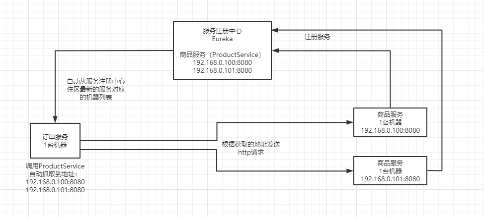
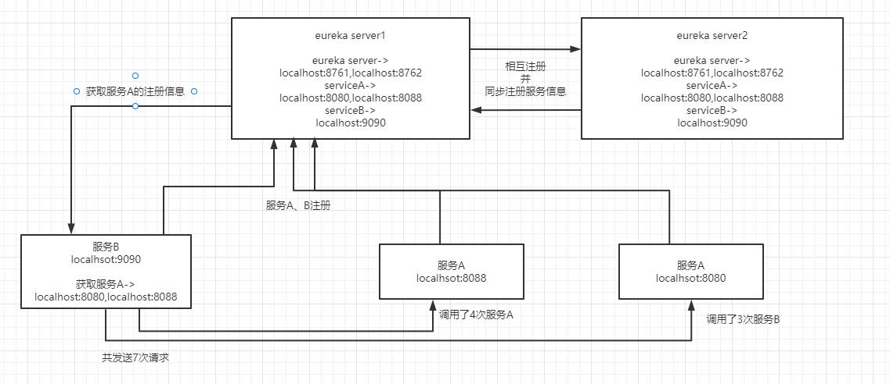

## **一、服务注册中心基本原理**

## **二、服务注册中心集群**

## **三、健康自检机制**

默认情况下，你的所有的服务，比如服务A和服务B，都会自动给eureka注册中心同步心跳，续约，每隔一段时间发送心跳，如果说某个服务实例挂了，那么注册中心一段时间内没有感知到那个服务的心跳，就会把那个服务给他下线。

还可以实现一个服务的健康检查的机制，自己来检查服务是否宕机，比如说，如果底层依赖的MQ、数据库挂了，你就宣布自己挂了，通知注册中心。

**1.心跳检测**

eureka客户端，默认会每隔30秒发送一次心跳的eureka注册中心，下面的那个参数可以修改这个心跳间隔时间，如果在90秒内没收到一个eureka客户端的心跳，那么就摘除这个服务实例，别人就访问不到这个服务实例了，通过下面的参数可以修改这个90秒的值。但是一般这俩参数建议不要修改。

这个心跳检测的机制其实叫做renew机制，看下面的参数配置就知道了，也可以叫做服务续约

eureka.instance.leaseRenewallIntervalInSeconds

eureka.instance.leaseExpirationDurationInSeconds

**2.注册表抓取**

默认情况下，客户端每隔30秒去服务器抓取最新的注册表，然后缓存在本地，通过下面的参数可以修改。

eureka.client.registryFetchIntervalSeconds

**3.自定义元数据**

可以通过下面的metadata-map定义服务的元数据，反正就是你自己需要的一些东西，不过一般挺少使用的

eureka:

instance:

hostname: localhost

metadata-map:

company-name: zhss

**4.自我保护模式**

如果在eureka控制台看到下面的东西：

**EMERGENCY! EUREKA MAY BE INCORRECTLY CLAIMING INSTANCES ARE UP WHEN THEY'RE NOT. RENEWALS ARE LESSER THAN THRESHOLD AND HENCE THE INSTANCES ARE NOT BEING EXPIRED JUST TO BE SAFE.**

这就是eureka进入了自我保护模式，如果客户端的心跳失败了超过一定的比例，或者说在一定时间内（15分钟）接收到的服务续约低于85%，那么就会认为是自己网络故障了，导致人家client无法发送心跳。这个时候eureka注册中心会先给保护起来，不会立即把失效的服务实例摘除，在测试的时候一般都会关闭这个自我保护模式：

eureka.server.enable-self-preservation: false

在生产环境里面，他怕自己因为自己有网络问题，导致别人没法给自己发心跳，就不想胡乱把别人给摘除，他就进入保护模式，不再摘除任何实例，等到自己网络环境恢复。