# Eureka服务注册

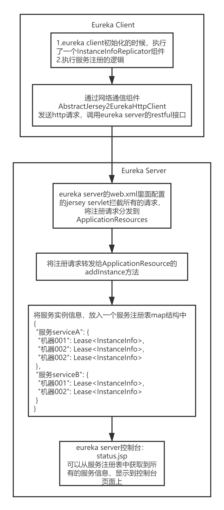

## 一、Eureka Client

1. 在Eureka Client启动时，执行initScheduledTasks()方法，启动调度任务。在该方法中，有一个InstanceInfoReplicator实例，该实例执行start()方法。这个start()方法就是Eureka Client服务注册的入口。

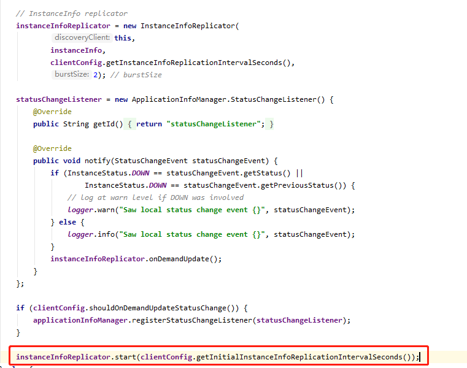

2. instanceInfoReplicator.start()方法中，将自己作为一个线程放到一个调度线程池中去，默认是延迟40秒去执行这个线程。

   并设置IsDirty的值。

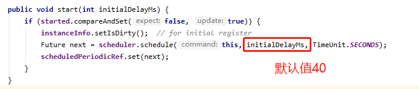

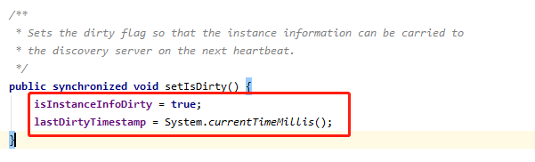

3. 该线程执行的时候，是执行该实例的run()方法。

   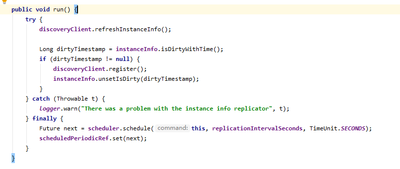

4. EurekaClient.refreshInstanceInfo()这个方法，里面其实是调用ApplicationInfoManager的一些方法，刷新了一下服务实例的配置，看看配置有没有改变，如果改变了则刷新配置信息。

   用健康检查器，检查了一下状态，将状态设置到了ApplicationInfoManager中去，更新服务实例的状态。

   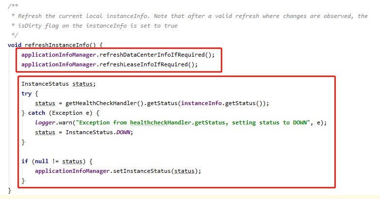

5. 第2步骤中，设置了IsDirty，所以这里会执行run()方法中，服务注册的方法：discoveryClient.register();

6. 服务注册时，是基于EurekaClient的reigster()方法去注册的，这里实际上是调用底层的TranportClient的RegistrationClient，执行了register()方法。

   这里的EurekaTransport实例，实际上实在Eureka Client启动源码中，第4步骤中初始化网络通信组件时构造的。

   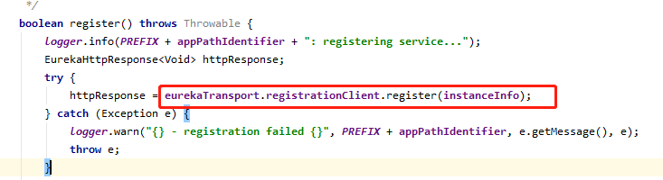

7. 真正执行注册请求的，就是eureka-client-jersey2工程里的AbstractJersey2EurekaHttpClient，请求http://localhost:8080/eureka/v2/apps/ServiceA，将服务实例的信息发送过去

## 二、Eureka Server

1. 服务端接收服务注册请求的，实际上是http://localhost:8080/eureka/v2/apps/ServiceA这个接口。这个接口在eureka-core里面的resource目录下ApplicationResource这个接口类。jersey里面的resource相当于springMVC的controller。本次源码阅读可以从eureka-core自带的测试方法作为入口。com.netflix.eureka.resources.ApplicationResourceTest#testGoodRegistration

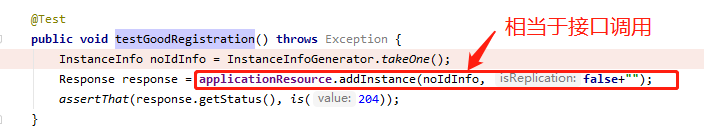

2. 在接口执行中，首先对参数InstanceInfo服务实例信息进行校验。进来就是大量的check相关的代码逻辑，防御式编程，保证代码的健壮性。但是一般建议这种校验逻辑代码，单独放在私有方法中去做，保证代码的可读性。

   InstanceInfo服务实例中，主要包括两块数据：

   1. 主机名、ip地址、端口号、url地址
   2. lease（租约）的信息：保持心跳的间隔时间、最近心跳的时间、服务注册的时间、服务启动的时间

   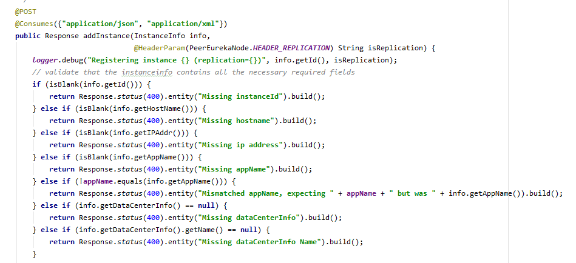

3. 处理dataCenterInfo，处理客户端可能正在使用丢失数据的坏DataCenterInfo注册的情况。

   这里的代码写的不好，采用了大量的if……else……硬编码。最起码应该使用策略模式，屏蔽掉这一块的if……else……

   策略模式，在外面的配置文件中，专门搞一个配置项，eureka.server.env = default，但是可以配置为eureka.server.env = aws。然后在代码里，如果是要区别对待AWS云环境的地方，直接就是根据这个外部的配置项，获取一个专门的对应的一个策略，比如说DefaultDataCenter，AWSDataCenter。对外都是统一的接口，DataCenter。统一的都是面向DataCenter来执行的。

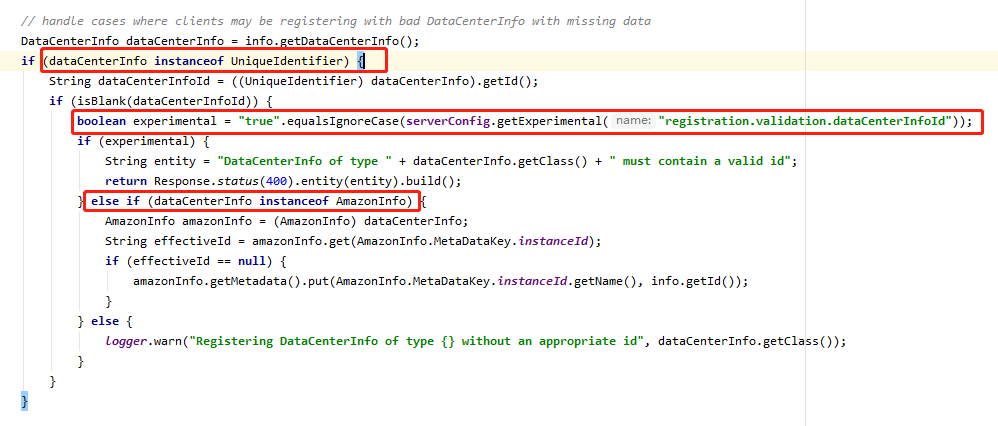

4. 接着执行服务注册方法，将服务实例往注册表注册。PeerAwareInstanceRegistry.register()方法实际上会调用父类AbstractInstanceRegistry的register()方法。

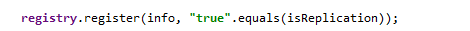

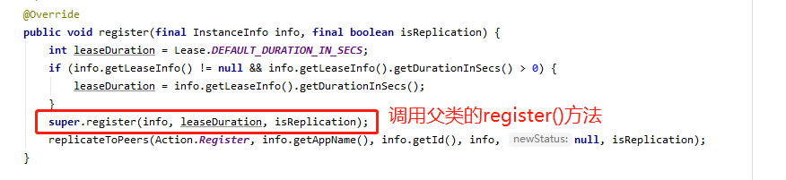

5. 服务实例注册，该过程中的几个闪光点。

   1. 注册表的数据结构：将服务的实例信息保存在map里，对应了服务的集群信息。

      {

      ​	"服务serviceA": {

      ​		"机器001": Lease<InstanceInfo>,

      ​		"机器002": Lease<InstanceInfo>,

      ​		"机器002": Lease<InstanceInfo>

      ​	}，

      ​	"服务serviceB": {

      ​		"机器001": Lease<InstanceInfo>,

      ​		"机器002": Lease<InstanceInfo>

      ​	}

      }

   2. 保证线程安全并发

      1. 内存注册表使用ConcurentHashMap保证多线程并发安全。
      2. 在注册的时候，上了读锁。保证多个服务实例同时来注册，可以读取，不能写入。

6. 完成了服务注册之后，我们平时访问的eureka控制台，其实就是eureka-resource包下status.jsp。
   1. 在jsp代码中，首先拿到了EurekaServerContext。
   2. 从EurekaServerContext中获取到注册表信息PeerAwareInstanceRegistry。从里面获取所有的服务信息，从底层的map数据结构中，获取所有的服务注册的信息，遍历，封装到一个叫Application的东西里去，一个Application就代表了一个服务，里面包含很多个服务实例。
   3. 然后将每个服务实例的信息进行处理，展示在控制台上。

