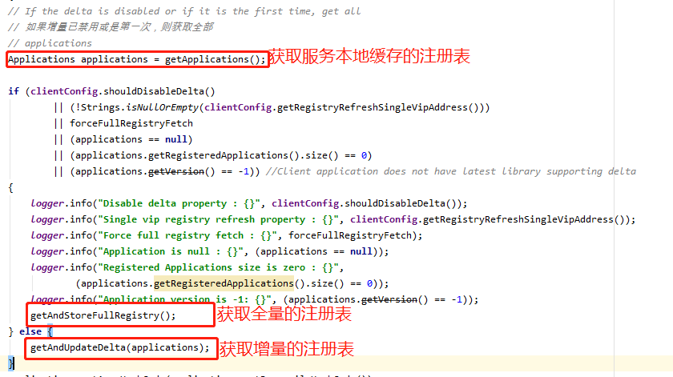
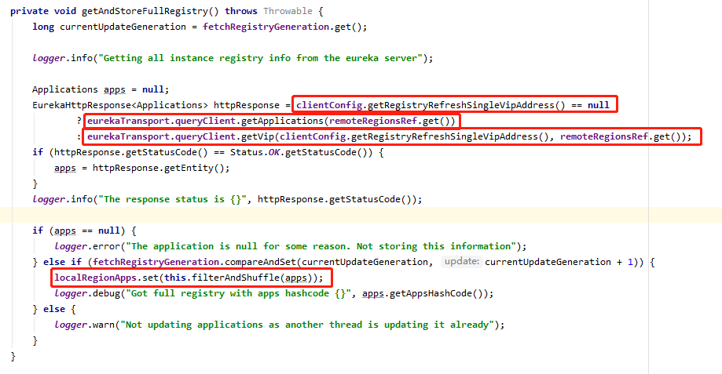
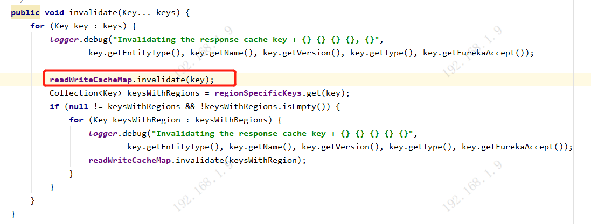
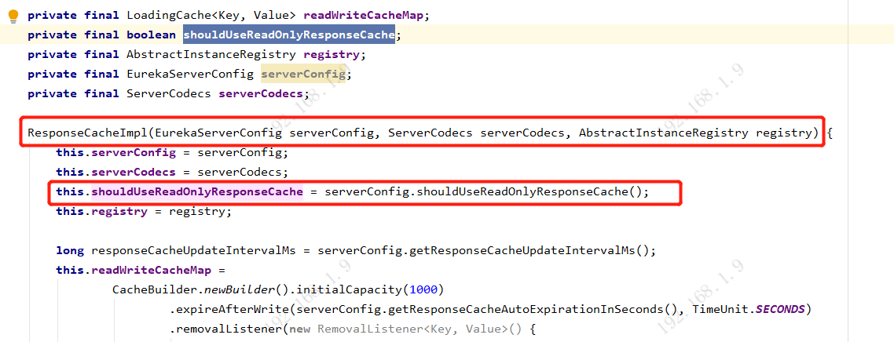
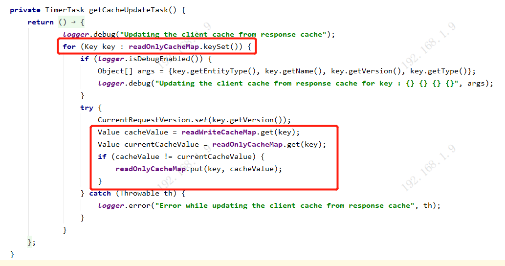

# Eureka启动全量抓取注册表

## 一、Eureka Client发送请求获取注册表

1. 在eureka client第一次启动的时候，会在初始化服务时全量抓取一次注册表。

2. 在fetchRegistry()方法中，首先会去获取eureka client服务本地缓存的注册表，第一次启动时肯定是没有的。

   如果时增量更新注册表被禁用了，或者第一次拉取注册表，则去获取全量的注册表。

3. 获取全量注册表getAndStoreFullRegistry()方法中
   1. 首先判断registryRefreshSingleVipAddress是否配置了参数，该配置表示该客户端服务只对单一的VIP注册表信息感兴趣，只获取单一的服务地址的注册表，默认为null。
   2. registryRefreshSingleVipAddress为null，则通过http请求去访问GET请求http://localhost:8080/eureka/v2/apps抓取全量的注册表。对应eureka-core包resources目录下的ApplicationsResource类下的getContainers()方法。
   3. 最后对抓取到的注册表set到本地。

## 二、Eureka server多级缓存读取注册表

1. Eureka Client抓取注册表调用的接口对应eureka-core包resources目录下的ApplicationsResource类下的getContainers()方法。在该接口方法中，会去缓存中加载注册表，返回给eureka client。cacheKey中参数为ALL_APPS

2. eureka server使用了多级缓存的机制来读取注册表信息。用了两个map，只读缓存的map和读写缓存的map，做了两级缓存。
   - 下面getValue()方法，就是先从只读缓存中去读，读取不到再去读写缓存中读取。useReadOnlyCache参数通过配置文件shouldUseReadOnlyResponseCache配置，默认为true。

3. readWriteCacheMap.get(key)中，如果读写缓存中获取不到，会从Eureka Server注册表中读取，读取到后会写入读写缓存中。最终返回注册表数据，并写入只读缓存中。

## 三、Eureka Server注册表多级缓存过期机制，主动过期+定时过期+被动过期

#### 1. 主动过期

readWriteCacheMap读写缓存，有新的服务注册、下线、故障的时候，就会刷新readWriteCacheMap。

例如服务注册时：

1. 服务注册完成的最后，会刷新缓存。

2. 使用如下Key去调用失效方法

3. 失效掉readWriteCacheMap中的相关Key

#### 2. 定时过期

readWriteCacheMap在初始化构建的时候，指定了一个自动过期的时间。默认是180s

#### 3. 被动过期

readOnlyCacheMap的过期策略，默认是每隔30s，执行一个定时调度的线程任务，会每隔30s，获取到readOnlyCacheMap中所有的key，然后获取到readOnlyCacheMap和readWriteCacheMap中的value值进行比对，如果发现不一致，会更新readOnlyCacheMap中的值。

1. 在初始化ResponseCacheImpl时，shouldUseReadOnlyResponseCache参数会从配置文件中加载对应的值，默认为true。

2. 如果shouldUseReadOnlyResponseCache为true，则会执行一个定时的调度任务，参数responseCacheUpdateIntervalMs，默认时30s执行一次。执行getCacheUpdateTask()

3. 对readOnlyCacheMap和readWriteCacheMap中的value值进行比较，如果不一致，则更新readOnlyCacheMap中的key-value

#### 4. 服务注册表获取延迟更新的问题。

因为readOnlyCacheMap的更新同步机制是默认每隔30s定时同步一次，所以在服务实例注册、下线、故障时，要调用这个服务的其他服务，可能30s之后才能感知到。