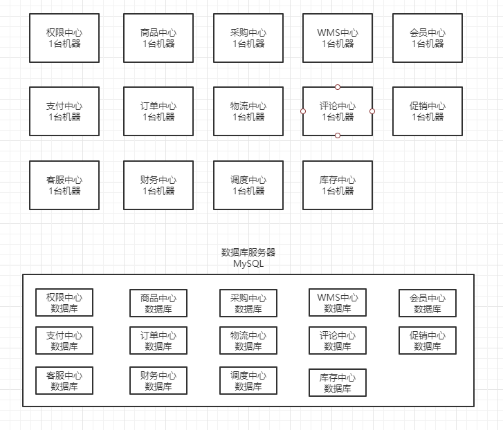

## 一、几十人开发一个复杂的单块系统，会有哪些问题

1. **代码复用性问题：**
   1. 各写各的，重复代码(sql/方法)到处都是。
2. **多人协作效率问题：**
   1. 多人同时修改一套代码，代码冲突
   2. 自己的功能上线，可能影响到别人的服务，依赖的东西非常多
3. **扩容问题**
   1. 服务扩容全都耦合在一起，有些服务是不需要扩容的，资源浪费
   2. 服务扩容需要保证系统是无状态的，在内存里保存的数据需要考虑扩容产生的影响。
4. **可用性问题**
   1. 某个边缘服务的方法出问题了，导致cpu打满，导致整个服务全部挂掉

## **二、微服务解决单块应用产生的问题**

​    

1. **代码复用性问题**
   1. 每个中心拆成独立的服务，每个服务都有自己的库。各个服务之间数据库是屏蔽的，想要某个查询只能让服务的负责人去开发对应的接口
2. **多人协作效率问题**
   1. 每个人负责自己的服务修改即可
3. **扩容问题**
   1. 服务扩容可以单独扩容自己的服务
4. **可用性问题**
   1. 某个服务部署的机器cpu打满之后，不会影响到其他服务。直接就将该服务熔断降级了

## **三、微服务基础技术架构**

1. 服务网关：zuul
2. 服务注册发现：Eureka
3. 负载均衡：Ribbon
4. 声明式Rest调用：Feign
5. 限流熔断：Hystrix
6. 认证授权：Spring Security + OAuth2 + JWT
7. 消息中间件：RabbitMQ + Spring Cloud Stream
8. 分布式协调：Spring Cloud Zookeeper
9. 开发框架：SpringBoot + Spring Web MVC + Spring Core + MyBatis
10. 服务文档：SwaggerUI
11. 消费者驱动市契约：Spring Cloud Contract

## **四、分布式系统架构产生的问题**

1. 分布式事务
2. 分布式锁
3. 分布式会话
4. 单点登录
5. 分布式一致性
6. 分布式接口幂等性
7. 高可用保护

## **五、其他技术**

1. ##### 容器技术：docker + k8s（kubernetes）

2. ##### DevOps + 持续集成 + 持续交付

   1. jenkins
   2. 自动化测试
   3. 自动化部署

3. ##### 微服务支撑运维平台

   1. 日志中心：ELK + Kafka + 自研组件，亿级大规模日志中心架构设计
   2. 机器与Metrics监控：OpenFalcon
   3. 配置中心：Apollo

4. ##### 敏捷开发和项目管理

5. ##### 微服务治理平台

   类似于大众点评的CAT，实现了调用链跟踪的监控。但是CAT实际上在国内应用不广泛，存在很多问题。

   自研调用链监控的整套微服务治理平台：

   	1. 服务分层
   	2. 服务鉴权
   	3. 故障诊断
   	4. 容量预估以及扩容告警
   	5. 可用性监测
   	6. QPS、请求量、响应时间的监测
   	7. 性能瓶颈定位
   	8. 调用链跟踪
   	9. 接口版本
   	10. 服务上下线审批
   	11. 流量控制
   	12. 等等……

6. ##### 线上生产环境的工程事件：

   1. A/B测试
   2. 蓝绿部署
   3. 灰度发布
   4. 全链路压测
   5. 系统回滚

