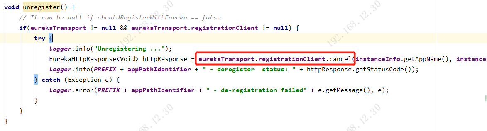

# Eureka服务实例下线

## 一、Eureka Client下线通知

1. Eureka Client服务下线会执行DiscoveryClient.shutdown()方法
   1. 销毁定时任务线程池
   2. 调用unregister();调用Eureka Server接口摘除实例
   3. 释放http client资源
   4. 销毁健康检查器

2. unregister()方法中，调用Eureka Server的接口，摘除注册表中的实例。执行DELETE请求，调用http://localhost:8080/eureka/v2/apps/ServiceA/i-000000-1

## 二、Eureka Server摘除实例

1. http://localhost:8080/eureka/v2/apps/ServiceA/i-000000-1和Eureka Client发送心跳的地址一样，最终会走到InstanceResource对象中，执行DELETE请求对应的cancelLease()方法。执行registry.cancel()方法摘除服务实例。

2. registry.cancel()方法最终会执行AbstractInstanceRegistry.internalCancel()方法。

   1. 首先根据服务名称和服务实例id从注册表中摘除服务实例

   

   2. 将该服务实例加入最近下线的服务实例队列recentCanceledQueue中

      

   3. 最核心的是调用了服务实例Lease的cancel()方法，保存服务下线的时间evictionTimestamp为当前时间戳

   

   4. 将下线的服务实例加入最近变更的服务实例队列recentCanceledQueue中，后面其他服务实例拉取增量注册表时，可以感知到下线的服务实例，然后更新自己本地的服务实例。

   

   5. 将readWriteCacheMap缓存中的注册表清理掉

   