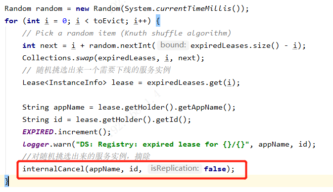

# Eureka-Server服务实例的自动故障感知和服务实例自动摘除机制

```
Eureka Client要主动下线的时候，会调用DiscoveryClient的shutdown方法，就会发送一个下线的请求到Eureka Server中。
但是很多时候，Eureka Client可能会突然宕机了，就不会发送shutdown方法。

Eureka Server自己有一个自动感知服务实例故障和服务实例自动摘除的机制，Eureka Client会定时发送心跳到Eureka Server，来通知自己是健康的，在Eureka Server中，当一段时间感知不到Eureka Client发送的心跳，就认为这个服务实例故障了，会自动从注册表中摘除。
```

###### 1.Eureka Server自动故障感知和服务实例自动摘除机制的入口，在Eureka Server启动初始化时，EurekaBootStrap类中的initEurekaServerContext()方法中，会去执行registry.openForTraffic()方法


###### 2.在registry.openForTraffic()方法中，会去调用父类的super.postInit()方法，回去启动一个定时任务，默认每隔60s执行一次


###### 3.定时任务执行EvictionTask的run()方法，首先执行getCompensationTimeMs()方法，获取定时任务执行延迟的时间


###### 4.在getCompensationTimeMs()方法中，会根据如下步骤执行


###### 5.接着执行run()方法中的evict(compensationTimeMs)方法，下线宕机的服务实例


###### 6.在evict()方法中，首先判断是否允许主动删除掉故障的服务实例


###### 7.然后执行lease.isExpired(additionalLeaseMs)方法，判断服务实例是否过期


###### 8.在lease.isExpired(additionalLeaseMs)方法中，判断服务实例是否主动下线，或者当前时间大于（最后一次心跳时间 + 系统设置的一个补偿时间duration(默认90s) + 定时任务延迟执行的时间）


###### 9.（分批摘取机制）Eureka Server的服务实例自动摘除过程中，有一个机制，不能一次性摘除过多的服务实例

```
如果一次性最多下线的服务实例，小于当前需要下线的服务数量，则会先随机下线一部分，其他的在下次定时任务执行的时候，再去下线摘除。
```


###### 10.（随机摘取机制）从需要下线的服务实例列表中，随机挑选一个，从注册表中摘除该服务实例



###### 11.最终执行的服务实例摘除方法，AbstractInstanceRegistry.internalCancel()，这个和Eureka服务实例主动下线时执行的时同一个方法。

[Eureka服务实例下线](https://github.com/zhzhf233/zhzhf-javaDoc/blob/master/%E6%9E%B6%E6%9E%84/eureka/10-Eureka%E6%9C%8D%E5%8A%A1%E5%AE%9E%E4%BE%8B%E4%B8%8B%E7%BA%BF.md)


### 总结：两个需要注意的地方

1. 存在一个Eureka官方知道，但不打算修复的bug，因为心跳的时候，设置最后一次心跳时间时，已经加过补偿时间duration了，这里又重复加了一次。
2. 服务故障检测出需要摘除的服务实例列表后，采用【分批摘除】和【随机摘除】机制。