# Eureka Server网络故障时的自我保护机制

```
Eureka Server如果在一定时间内，感知到很少一部分的Eureka Client发送的心跳，这个时候Eureka Server会认为自己网络故障了，导致Eureka Client的心跳发送不过来，就会将自己进入一个自我保护的机制，然后不会主动摘除任何服务实例。
注：自我保护机制开启后，只是在自动故障感知时服务实例摘除的定时任务中，不会再去执行故障感知和服务实例主动摘除。但不会影响Eureka Client执行shutdown主动去调用Eureka Server摘除服务实例的接口。
```

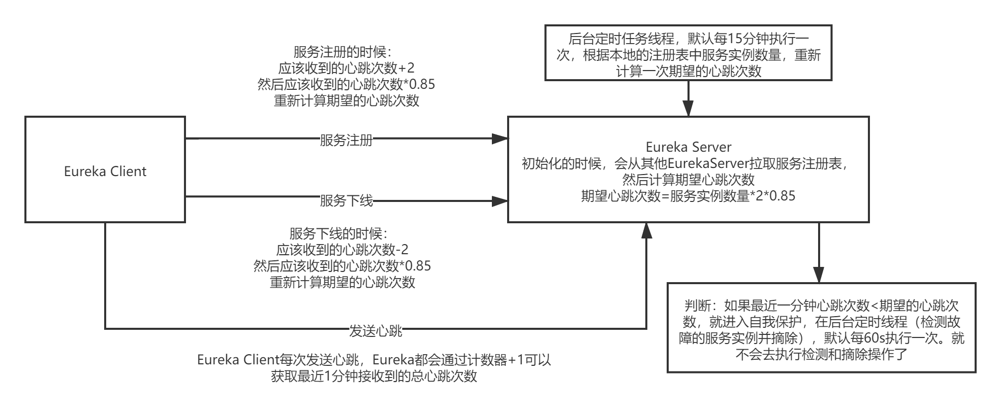

###### 1.在Eureka Server服务实例的自动故障感知，服务实例自动摘除的过程中，也就是执行自动检测服务实例故障的定时任务方法evict(compensationTimeMs)过程中，首先会判断Eureka Server有没有进入自我保护机制，如果进入了自我保护机制，就会直接退出，不再执行自动故障感知和服务实例摘除。

1. 执行isLeaseExpirationEnabled()，检测是否允许主动删除掉故障的服务实例

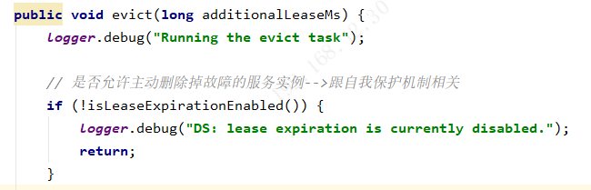

2. 在isLeaseExpirationEnabled()方法中

   1. 首先检查是否开启了自我保护机制，如果没有开启，则直接返回true，允许删除掉故障的服务实例
   2. 然后判断numberOfRenewsPerMinThreshold（期望一分钟内有多少次心跳）是否大于0
   3. 判断getNumOfRenewsInLastMin()（实际一分钟内有多少次心跳）是否大于numberOfRenewsPerMinThreshold

   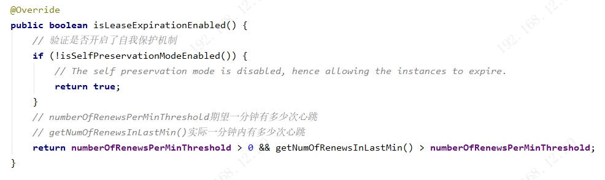

###### 2.numberOfRenewsPerMinThreshold（期望一分钟内有多少次心跳）解读

1. 在Eureka Server启动初始化的时候，会执行registry.openForTraffic()启动服务自动故障感知和服务实例主动摘除的定时任务

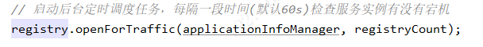

2. 在PeerAwareInstanceRegistryImpl.openForTraffic()方法中，会对numberOfRenewsPerMinThreshold进行初始化。

   1. 因为Eureka Client的心跳间隔是每个30s执行一次，所以每分钟会有两次心跳，所以首先对服务实例的数量*2.（这里代码写的很烂，采用了硬编码，对服务实例乘于2，如果Eureka Client修改了心跳的间隔，这里的自我保护机制就会出现问题）
   2. 然后对服务实例乘于2之后，再乘于一个系统配置的基数serverConfig.getRenewalPercentThreshold()，默认0.85，最后取整得出期望一分钟内有多少次心跳

   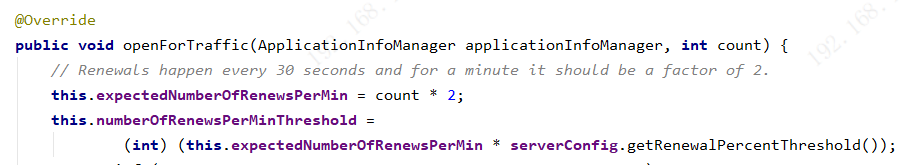

3. 在服务注册时，会对expectedNumberOfRenewsPerMin执行 +2 的操作，然后重新计算numberOfRenewsPerMinThreshold（同样存在硬编码的问题）

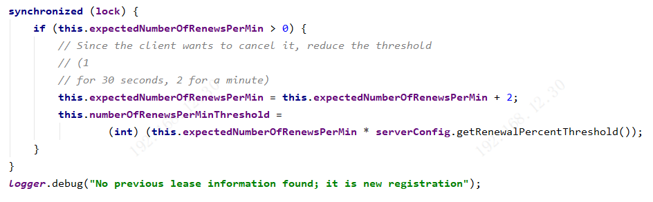

4. 在服务下线时，会对expectedNumberOfRenewsPerMin执行 -2 的操作，然后重新计算numberOfRenewsPerMinThreshold（同样存在硬编码的问题）

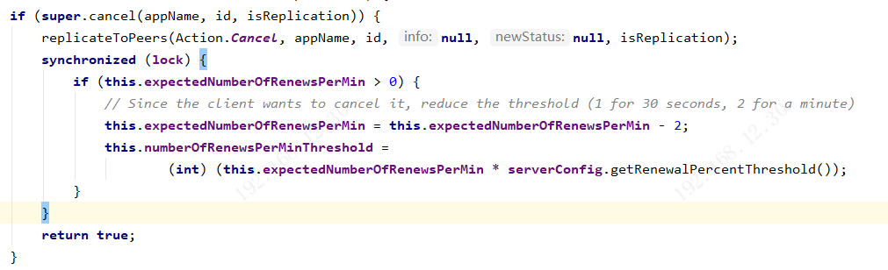

5. 服务实例自动故障感知和自动下线服务实例的代码中，没有找到对期望心跳numberOfRenewsPerMinThreshold更新的代码，bug，如果有很多服务实例故障下线，会导致期望的心跳次数没有减少，很快会导致eureka server进入自我保护机制。

6. 定时更新numberOfRenewsPerMinThreshold

   1. 在Eureka Server初始化的时候，会启动一个定时任务，默认每15分钟执行一次

   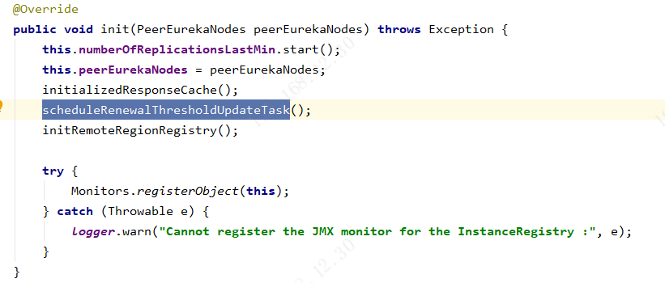

   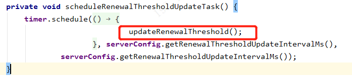

   2. 定时任务执行updateRenewalThreshold()方法，首先去获取本地Eureka Server作为Eureka Client本地缓存的注册表

   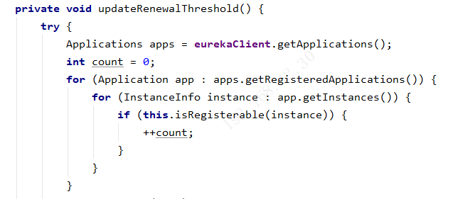

   3. 然后对本地缓存的注册表中服务实例数量*2，计算出应该收到的心跳数量，判断是否大于当前期望的心跳数量乘于系统设定的基数（默认0.85），或者满足系统设定的是否没有启用自我保护模式的配置this.isSelfPreservationModeEnabled()（默认为true）。基于这两个判断，满足其一就对numberOfRenewsPerMinThreshold进行重新计算

   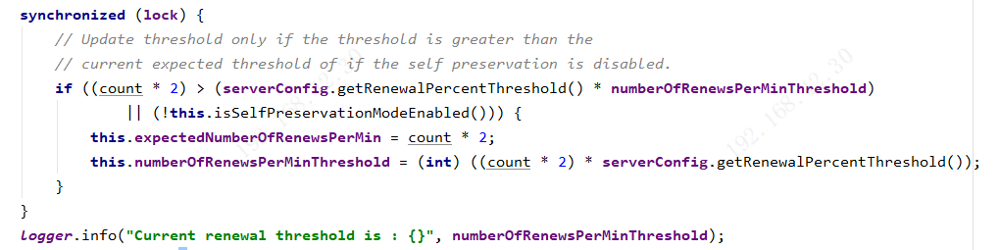

###### 3.getNumOfRenewsInLastMin()（实际一分钟内有多少次心跳）解读

1. 这个方法会去获取一个计数器中的值

   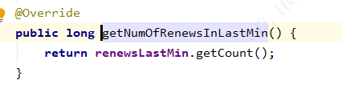

2. 这个计数器，在每次Eureka Client发送心跳的时候，Eureka Server执行代码中，都会进行+1操作。

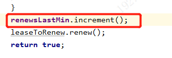

###### 4.Eureka自我保护机制，线上的时候，最容易出问题的就是这里。当你发现有些服务实例下线了，但是Eureka Server控制台没有把它摘除，其实就是进入自我保护机制了。