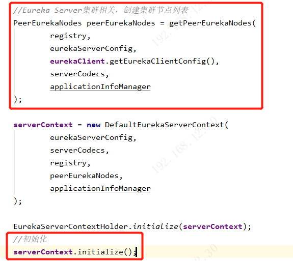
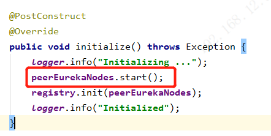
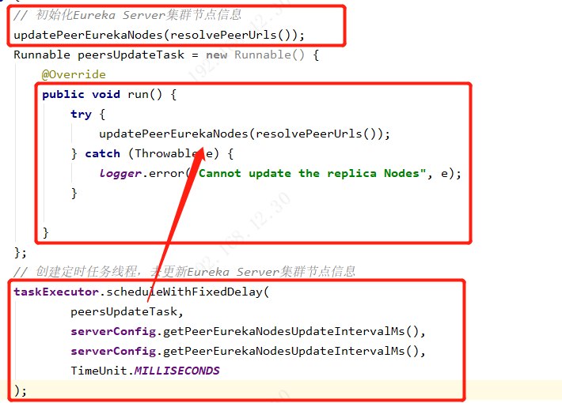
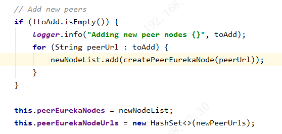
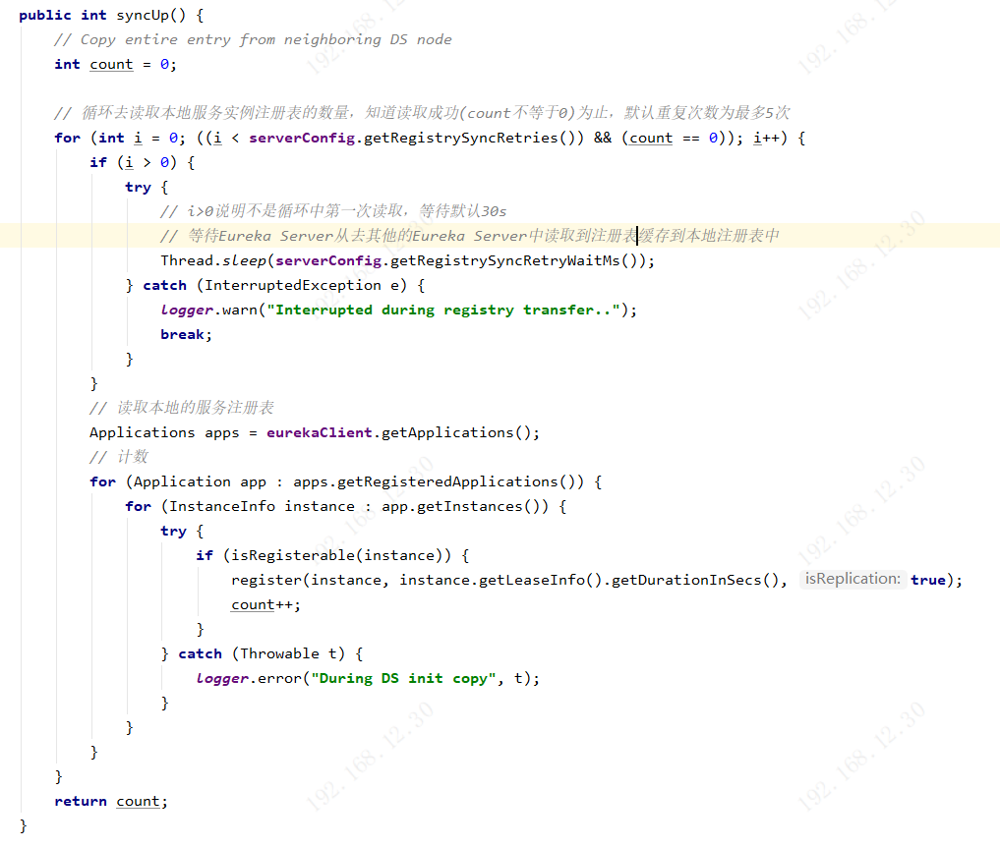
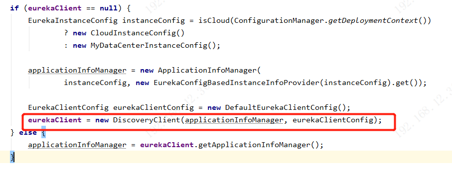
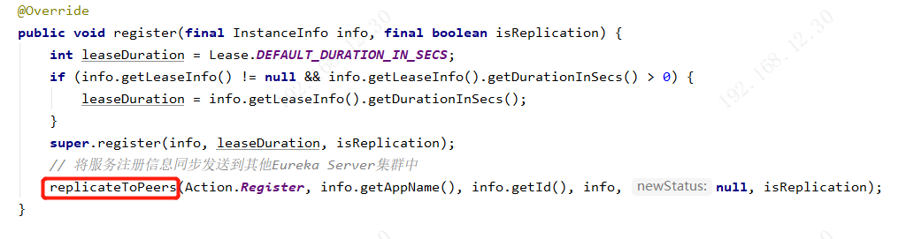
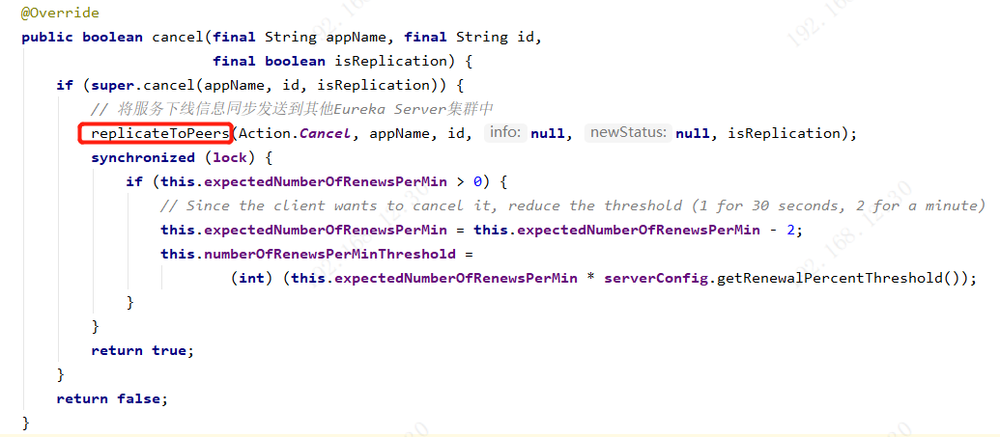
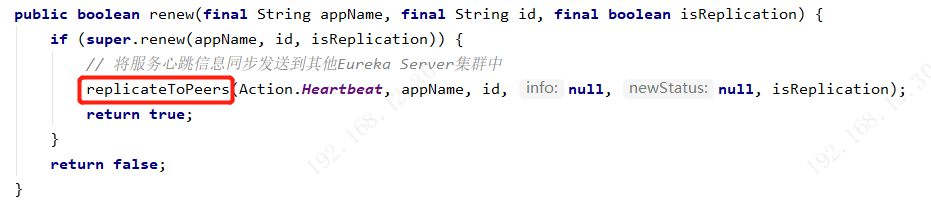

# Eureka集群机制：注册表同步及高可用

#### 1.Eureka Server在初始化的时候，从配置文件中读取其他Eureka Server节点

1. 在eureka-core里的EurekaBootStrap里面，初始化Eureka Server时，会创建并调用serverContext.initialize()初始化PeerEurekaNodes。



2. 在serverContext.initialize()方法中，会执行peerEurekaNodes.start()方法，对集群节点进行初始化

   

3. 在peerEurekaNodes.start()方法中会初始化Eureka Server的集群节点信息，并创建一个定时任务，默认每隔10分钟对Eureka Server集群节点信息进行更新。

   

4. updatePeerEurekaNodes()方法中，就是对配置文件中读取到的Eureka Server集群的url地址，构建出单独的PeerEurekaNode，每一个PeerEurekaNode就代表了一个Eureka Server



#### 2.在Eureka Server初始化过程中，会执行registry.syncUp()，获取本地注册表中服务实例的数量。



#### 3.在Eureka Server初始化时，会去初始化EurekaClient实例，初始化EurekaClient实例时，会去其他Eureka Server中拉取注册表，缓存到本地的注册表中。

执行流程：

```
EurekaBootStrap.contextInitialized()
initEurekaServerContext()
new DiscoveryClient(applicationInfoManager, eurekaClientConfig)
fetchRegistry(false)
getAndStoreFullRegistry()
```



#### 4.当一台Eureka Server处理Eureka Client服务注册、下线、故障、心跳时，会同步到其他的Eureka Server

1. 服务注册

   

2. 服务下线

   

3. 服务故障

   服务实例的自动故障感知和自动摘除服务实例时，不会进行同步。

4. 服务心跳

   