# Eureka集群机制：注册表同步使用的3层队列任务异步批处理机制

```
在Eureka Client调用Eureka Server接口，进行注册，下线，心跳时，会选一个进行调用。
Eureka Server集群中的某一个Server节点执行该操作后，会同步给集群中其他的Server节点。
```

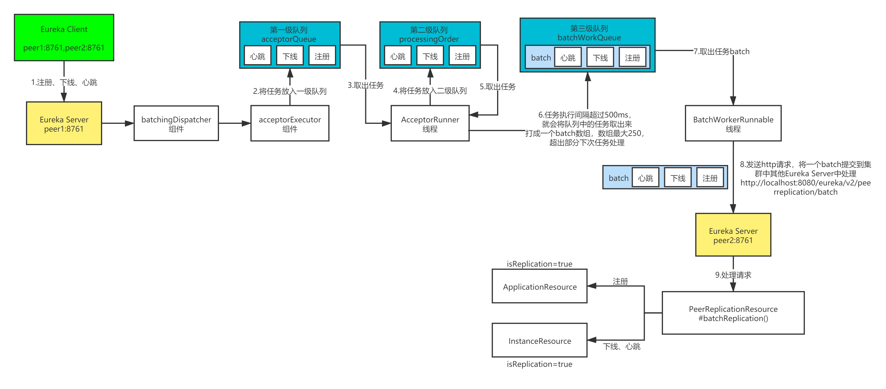

‘这里以服务注册为例。

###### 1.服务注册完成后，会执行replicateToPeers()方法，将服务注册信息发送到其他Eureka Server集群节点中

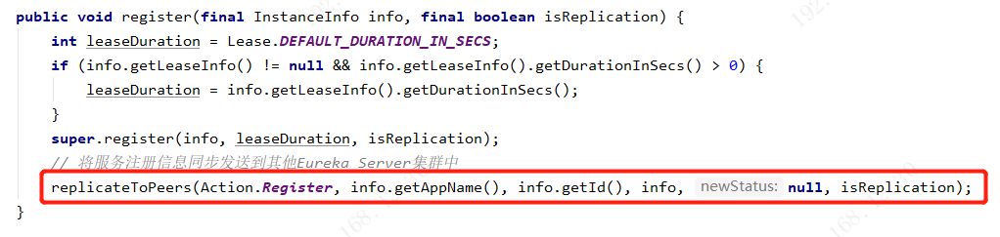

###### 2.replicateToPeers()方法中，会遍历Eureka Server集群的节点，分别去同步信息，如果是当前节点，则跳过

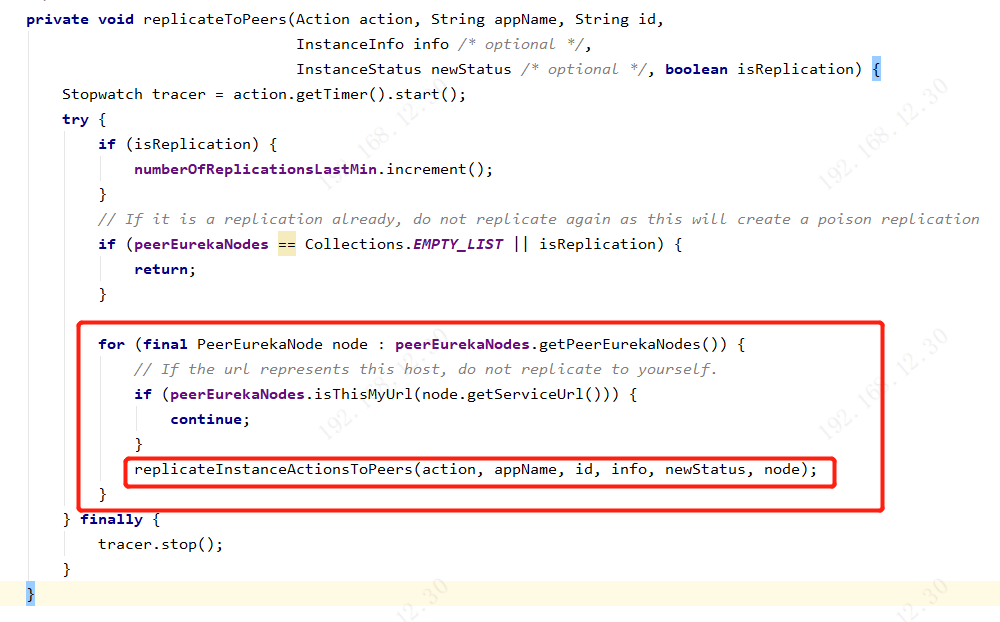

###### 3.replicateInstanceActionsToPeers()方法，会对不同类型的信息进行分发，执行不同的方法，服务注册执行node.register()方法

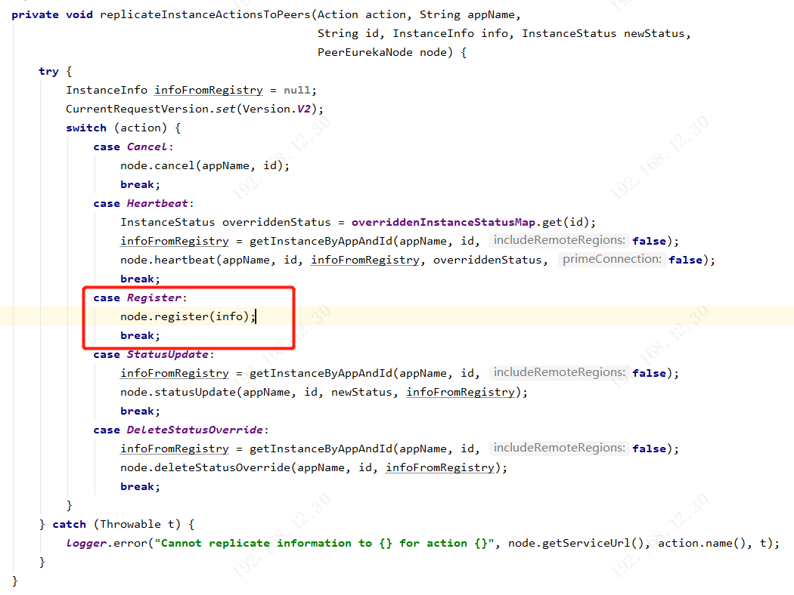

###### 4.PeerEurekaNode.register()方法解读：（三层队列任务异步批处理机制）

1. 通过batchingDispatcher组件，执行batchingDispatcher.process()方法

   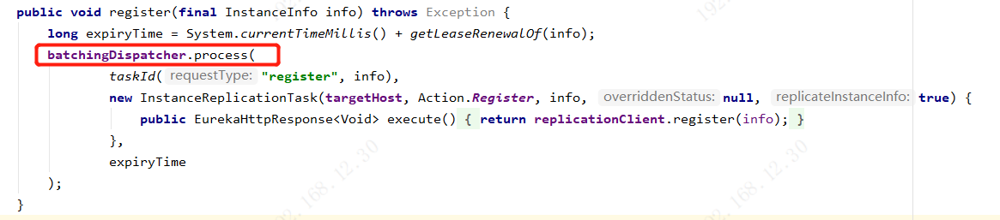

2. 通过acceptorExecutor组件，执行acceptorExecutor.process()方法

   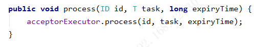

3. **第一级队列acceptorQueue**：acceptorExecutor.process()方法中，将任务添加到acceptorQueue队列中

   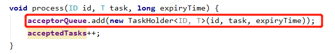

4. **第二级队列processingOrder**：后台会启动一个线程AcceptorRunner，将第一级队列中的acceptorQueue中的任务放入processingOrder中

   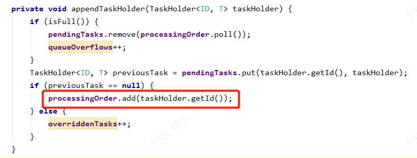

5. **第三级队列batchWorkQueue**：后台线程AcceptorRunner执行完第4步，将任务放入了processingOrder后。

   1. 会判断间隔时间，如果超过(默认)500ms，就将队列中的任务取出来放入一个batch中

   2. 一个batch中最多存放250个任务，如果放不下，则下次处理。

   3. 最后将batch任务数组放入到batchWorkQueue中

      注：1，2步骤，其实就是时间间隔小于500ms不处理，如果大于250个任务，则超出部分下次处理

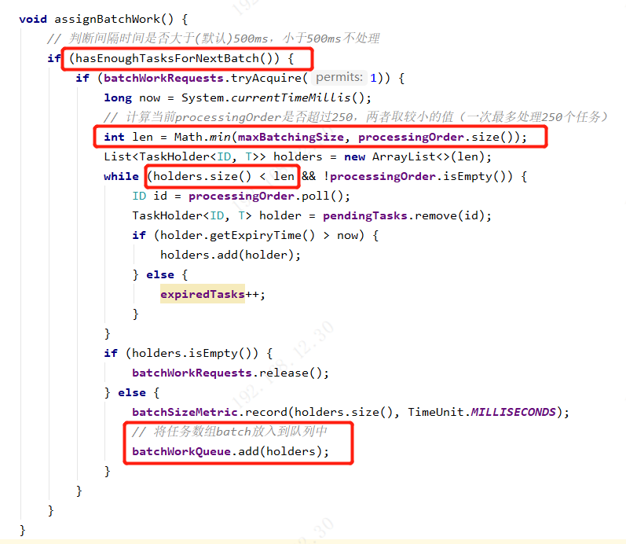

6. 后台会启动一个BatchWorkerRunnable线程，读取batchWorkQueue中的任务数组batch，然后调用processor.process(tasks)执行任务

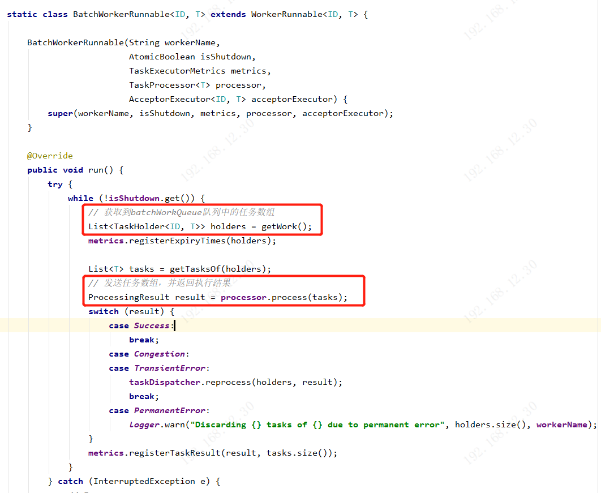

7. processor.process(tasks)方法中，会通过http调用集群中其他Eureka Server的接口:http://localhost:8080/eureka/v2/peerreplication/batch

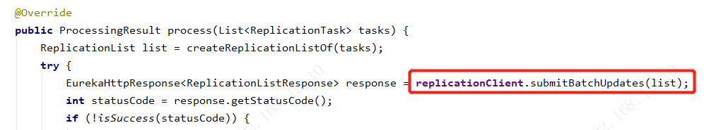

8. 其他Eureka Server接收到http请求后，会执行PeerReplicationResource#batchReplication()方法，对遍历任务数组，执行dispatch()方法根据任务类型进行不同的处理，并分别将处理结果放入batchResponse中。

   

   

   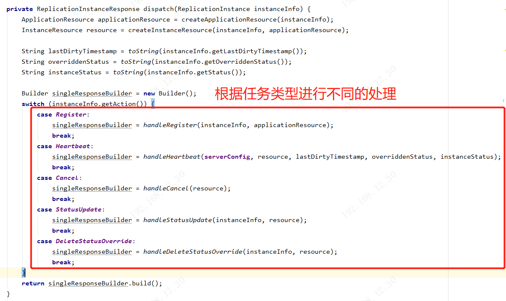

9. 在集群中间注册表同步的任务处理中，执行对应的方法时，会有一个参数isReplication固定为true，表示的含义是执行该方法时，不再对集群中的其他服务实例进行同步，否则就陷入了无限循环同步

   在注册表对集群进行同步的代码中，如果遇到isReplication=true，则直接退出方法

   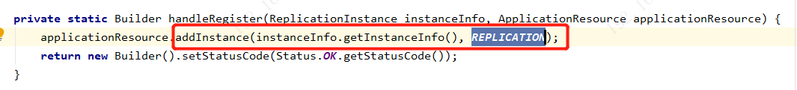

   


