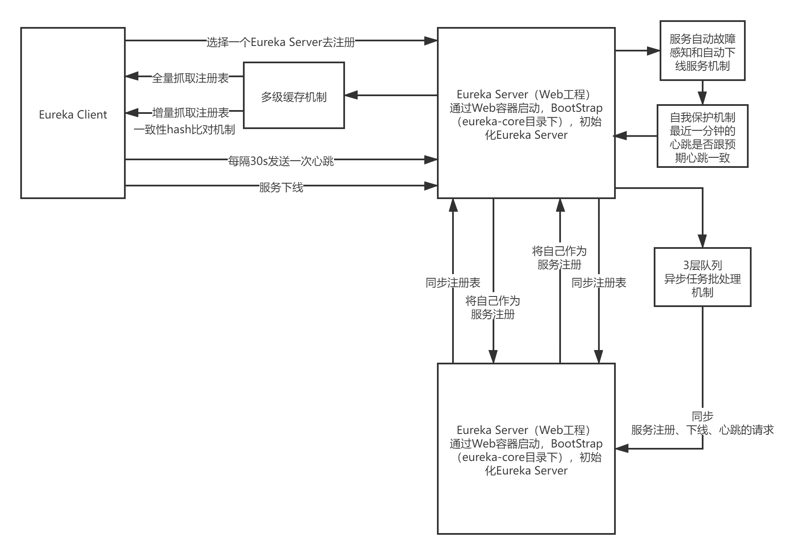

# Eureka整体架构图

（1）eureka server启动：注册中心

（2）eureka client启动：服务实例

（3）服务注册：map数据结构

（4）eureka server集群：注册表的同步，多级队列的任务批处理机制

（5）全量拉取注册表：多级缓存机制

（6）增量拉取注册表：一致性hash比对机制

（7）心跳机制：服务续约，renew

（8）服务下线：cancel

（9）服务故障：expiration，eviction

（10）自我保护：自动识别eureka server出现网络故障了

（11）控制台：jsp页面