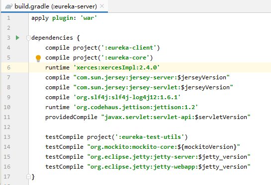
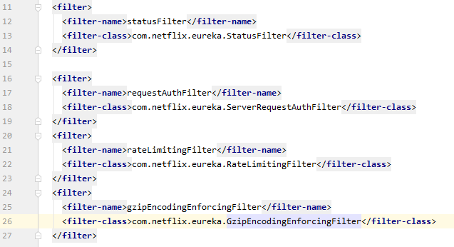
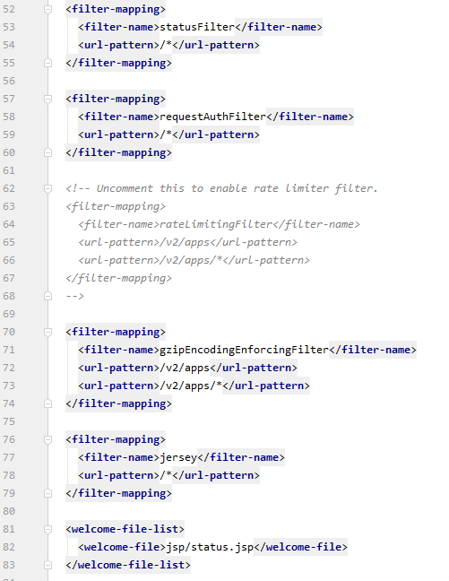

## **一、核心组件**

**1.SpringCloud Eureka 和Netflix Eureka的关系**

spring cloud eureka server和client是对netflix的eureka进行了封装，加了一些注解，对spring boot进行支持

https://github.com/spring-cloud/spring-cloud-netflix

https://github.com/Netflix/eureka

spring cloud Edgware.SR3对应的是netflix eureka的1.7.2的版本

**2.核心组件**

（1）eureka-client：这个就是指的eureka的客户端，注册到eureka上面去的一个服务，就是一个eureka client，无论是你要注册，还是要发现别的服务，无论是服务提供者还是服务消费者，都是一个eureka客户端。

（2）eureka-core：这个就是指的eureka的服务端，其实就是eureka的注册中心

（3）eureka-resources：这个是基于jsp开发的eureka控制台，web页面，上面你可以看到各种注册服务

（4）eureka-server：这是把eureka-client、eureka-core、eureka-resources打包成了一个war包，也就是说eureka-server自己本身也是一个eureka-client，同时也是注册中心，同时也提供eureka控制台。真正的使用的注册中心

（5）eureka-examples：eureka使用的例子

（6）eureka-test-utils：eureka的单元测试工具类

**3.eurka源码**

1. eureka server的启动，相当于是注册中心的启动 -> 启动的过程搞清楚，初始化了哪些东西
2. eureka client的启动，相当于是服务的启动，初始化了哪些东西
3. eureka运行的核心的流程
   1. eureka client往eureka server注册的过程，服务注册
   2. eureka client从eureka server获取注册表的过程,服务发现
   3. eureka client定时往eureka server发送续约通知（心跳）,服务心跳
   4. 服务实例摘除
   5. 通信
   6. 限流
   7. 自我保护
   8. server集群

## **二、eureka server启动**

### 1.eureka server项目预览

**1）项目依赖：build.gradle**

1. eureka client：eureka server也是一个eureka client，因为后面我们讲到eureka server集群模式的时候，eureka server也要扮演eureka client的角色，往其他的eureka server上去注册。
2. eureka core：扮演了核心的注册中心的角色，接收别人的服务注册请求，提供服务发现的功能，保持心跳（续约请求），摘除故障服务实例。eureka server依赖eureka core的，基于eureka core的功能对外暴露接口，提供注册中心的功能
3. jersey框架：eureka server依赖jersey框架，你可以认为jersey框架类比于spring web mvc框架，支持mvc模式，支持restful http请求。jersey在国内几乎没什么公司使用，很少很少，在国外有一些公司用，netflix就会用，jersey去开发eureka。eureka里面，服务通信，都是基于http请求的，restful接口来通信的。eureka client和eureka server之间进行通信，都是基于jersey框架实现http restful接口请求和调用的。eureka-client-jersey2，eureka-core-jersey2，猜测一下，就知道，其实这两个工程，就是eureka为了方便自己，对jersey框架的一个封装，提供更多的功能，方便自己使用。
4. mocktio：mock测试框架，之前项目阶段一里面，我们大量用了mockito框架，来写单元测试。在eureka框架里面，他每个工程都是有src/test/java的哦，里面都写了针对自己本工程的单元测试，必须得写。mock就是用的mockito框架。
5. jetty：方便你测试的，测试的时候，是会基于jetty直接将eureka server作为一个web应用给跑起来，jetty作为web容器，跑起来eureka server这个web应用。跑起来之后，eureka server不就活在jetty web容器里面了，jersey对外暴露了一些restful接口，然后测试类里，就可以基于jersey的客户端，发送http请求，调用eureka server暴露的restful接口，测试比如说：服务注册、心跳、服务实例摘除，等等功能。

1. 把这个eureka-server工程，打成一个war包，会怎么样，会将eureka-resources下面的那些jsp、js、css给搞到这个war包里面去，然后就可以跑起来，提供一个index页面。我们之前启动了eureka-server之后，第一件事儿就是访问他的控制台，可以去看看有谁来注册了。控制台的代码，就在jsp里面，就是eureka-resources的jsp提供的，人家还有对应的css和js呢。
2. 人家eureka-server的web.xml里，设置好了welcome-file-list，就是status.jsp页面，这个页面就会在打war包的时候，从eureka-resources里面给打到eureka-server里的，eureka-server里就会包含jsp目录，里面就有这个status.jsp。我们之前看到的那个eureka控制台的页面，就是这个status.jsp，里面一堆jsp代码，把你注册的服务的信息，全部都提出来，显示到页面上去。

**2）eureka server项目本质**

1. eureka-server的本质，就是一个web应用，跟你用spring mvc+spring+mybatis+jsp写出来的这个web应用没两样。你看着这个东西有点陌生，只不过是因为人家用了gralde来构建，国内很少用gradle来构建的。
2. 分析一下eureka-server的web.xml，你呢已经知道eureka-server就是个web应用的本质，无论是用tomcat还是jetty都可以启动，如果用tomcat启动，你就用gradle把这个eureka-server打成一个war包，让tomcat的webapps里面，启动tomcat就ok了。如果是用jetty的话，人家是在测试代码里用jetty去启动这个web应用的。

**3）web.xml**

1. 最最重要的就是listener，listener是在web应用启动的时候就会执行的，负责对这个web应用进行初始化的事儿，我们如果自己写个web应用，也经常会写一个listener，在里面搞一堆初始化的代码，比如说，启动一些后台线程，加载个配置文件。com.netflix.eureka.EurekaBootStrap

1. 又连着4个Filter，任何一个请求都会经过这些filter，这些filter会对每个请求都进行处理，这个4个filter都在eureka-core里面

   （1）StatusFilter：负责状态相关的处理逻辑

   （2）ServerRequestAuthFilter：一看就是，对请求进行授权认证的处理的

   （3）RateLimitingFilter：负责限流相关的逻辑的（很有可能成为eureka-server里面的一个技术亮点，看看人家eureka-server作为一个注册中心，是怎么做限流的，先留意算法是什么，留到后面去看）

   （4）GzipEncodingEnforcingFilter：gzip，压缩相关的；encoding，编码相关的

1. jersey框架的一个ServletContainer的一个filter，我可以告诉大家，类似于每个mvc框架，比如说struts2和spring web mvc，都会搞一个自己的核心filter，或者是核心servlet，配置在web.xml里，用了框架之后，相当于就是将web请求的处理入口交给框架了，框架会根据你的配置，自动帮你干很多事儿，最后调用你的一些处理逻辑。
2. jersey也是一样的，这里的这个ServletContainer就是一个核心filter，接收所有的请求，作为请求的入口，处理之后来调用你写的代码逻辑。

1. filter-mapping是配置这些filter在哪些目录下生效。
   1. StatusFilter和RequestAuthFilter，一看就是通用的处理逻辑，是对所有的请求都开放的
   2. RateLimitingFilter，默认是不开启的，如果你要打开eureka-server内置的限流功能，你需要自己把RateLimitingFilter的的注释打开，让这个filter生效
   3. GzipEncodingEnforcingFilter，/v2/apps相关的请求，会走这里，仅仅对部分特殊的请求生效
   4. jersey核心filter，是拦截所有的请求的

1. welcome-file-list，是配置了status.jsp是欢迎页面，首页，eureka-server的控制台页面，展示注册服务的信息

### 2.初始化配置管理器

1. 源码阅读的入口，从web.xml的listener开始，可以看到项目的入口在EurekaBootStrap

2. EurekaBootStrap类中加载contextInitialized()方法，首先会执行本类中的initEurekaEnvironment()方法。

3. initEurekaEnvironment()方法，首先会去加载并初始化配置管理器（ConfigurationManager实例）

4. ConfigurationManager实例使用volatile修饰，实例化采用double check + volatile修饰实现了单例模式

5. 回到第3步中的initEurekaEnvironment()方法，初始化配置管理器中的数据中心和运行环境

### 3.加载eureka-server.properties配置文件中的配置

1. 继续com.netflix.eureka.EurekaBootStrap#contextInitialized()方法执行同类中的initEurekaServerContext()方法

2. initEurekaServerContext()方法，第一步操作为加载系统配置文件到配置管理器中

3. EurekaServerConfig为一个配置项接口，定义了eureka-server.properties中的所有配置获取方法。

4. DefaultEurekaServerConfig是EurekaServerConfig接口的一个实现类，初始化该类的时候，会执行init()方法

5. init()方法中，会完成eureka-server.properties配置文件中配置项的加载，都放到ConfigurationManager中去，其中有一个EUREKA_PROPS_FILE常量对象，对应着要加载的eureka的配置文件的名字，默认为：eureka-server.  

6. init()方法中，下面执行的loadCascadedPropertiesFromResources()方法，会自动拼接上.properties，如果设置了test运行环境，还会加上对应的-test,从而获取到对应的配置文件读取，并通过配置管理器ConfigurationManager的实例instance执行addConfiguration()方法，添加到配置文件管理器DynamicPropertyFactory的实例instance中去。

7. 上面步骤中就已经把eureka-service.properties配置中的配置信息都添加到配置文件管理器DynamicPropertyFactory的实例instance中去了，所以接下来获取配置信息可以直接通过EurekaServerConfig接口的实现类：DefaultEurekaServerConfig中的方法获取。configInstance实例就是配置文件管理器DynamicPropertyFactory的实例instance。

   需要注意的是：配置项的名字，都是在获取配置项的方法中硬编码的。如果没有配置会自动添加一些默认值。

### 4.初始化Eureka-Server作为一个Eureka-Client的配置信息

1. ###### 在initEurekaServerContext()方法中，初始化一个ApplicationInfoManager空对象。

2. ###### EurekaInstanceConfig

   与上面初始化EurekaServerConfig加载eureka-server.properties类似，其实就是将eureka-client.properties文件中的配置加载到ConfigurationManager中去，然后基于EurekaInstanceConfig对外暴露的接口来获取这个eureka-client.properties文件中的一些配置项的读取，提供了一些配置项的默认值。

3. ###### new EurekaConfigBasedInstanceInfoProvider(instanceConfig).get()

   这段代码返回的结果是一个InstanceInfo对象，就是当前这个Eureka-Server服务作为一个Eureka-Client服务实例所需要的一些信息。

   使用构造器模式，用InstanceInfo.Builder来构造一个代表服务实例的InstanceInfo复杂对象。

   核心的思路是，从之前的那个EurekaInstanceConfig中，读取各种各样的服务实例相关的配置信息，再构造了几个其他的对象，最终完成了InstanceInfo的构建。

4. ###### applicationInfoManager = new ApplicationInfoManager(instanceConfig, new EurekaConfigBasedInstanceInfoProvider(instanceConfig).get());

   这段代码是基于第2步构建的EurekaInstanceConfig和第3步构建的InstanceInfo，构造了一个ApplicationInfoManager，后面会基于这个ApplicationInfoManager对服务实例进行一些管理。

   

5. ###### EurekaClientConfig eurekaClientConfig = new DefaultEurekaClientConfig();

   EurekaClientConfig，这个东西也是个接口，也是对外暴露了一大堆的配置项，包含的是EurekaClient相关的一些配置项。也是去读eureka-client.properties里的一些配置，只不过他关注的是跟之前的那个EurekaInstanceConfig是不一样的，EurekaClientConfig主要关注服务实例的一些配置项，关联的EurekaClient的配置项。

6. ###### eurekaClient = new DiscoveryClient(applicationInfoManager, eurekaClientConfig);

   基于第4步构建的ApplicationInfoManager（包含了第2步构建的EurekaInstanceConfig，服务实例的信息、配置；和第3步构建的InstanceInfo，作为服务实例管理的一个组件）和eurekaClientConfig（eureka-client相关的配置），一起构建了一个EurekaClient，构建的时候，用的是EurekaClient的子类DiscoveryClient。

   最终使用的这个构造方法：

   

   1. 读取ApplicationInfoManager,包括其中的InstanceInfo；读取EurekaClientConfig，包括TransportConfig

   

   2. 处理了是否要注册以及抓取注册表，如果不要的话，释放一些资源

   

   3. 创建支持调度的线程池，支持心跳的线程池，支持缓存刷新的线程池

   

   4. 创建EurekaTransport对象，支持底层的eureka-client跟eureka-server进行网络通信的组件，对网络通信组件进行了一些初始化的操作。

   

   5. 如果要抓取注册表的话，在这里就会去抓取注册表，如果抓取失败，会从备份信息中抓取。但是如果说你配置了不抓取，那么这里就不抓取了

   

   6. 初始化调度任务

      

      1. 如果要抓取注册表的话，就会注册一个定时任务，按照你设定的那个抓取的间隔（默认是30s），每个一段时间，去执行一个CacheRefreshThread,放到调度线程池里。

         

      2. 如果要向eureka server进行注册的话。

         

         1. 会搞一个定时任务，每隔一定时间发送心跳，执行一个HeartbeatThread，放到调度线程池里。
         2. 创建服务实例副本传播器
         3. 创建服务实例的状态变更的监听器
         4. 如果你配置了监听，那么就会注册监听器
         5. 将第2步创建的服务实例副本传播器作为一个定时任务进行调度。

### 5.构造一些实例的配置项

1. 构造PeerAwareInstanceRegistry实例。

   peers:集群，peer代表集群中的一个实例。InstanceRegistry代表实例注册表，所以PeerAwareInstanceRegistry实例代表了所有注册到这个eureka-server上的服务实例注册表。

   可以感知eureka server集群的服务实例注册表，eureka client（作为服务实例）过来注册的注册表，而且这个注册表是可以感知到eureka server集群的。假如有一个eureka server集群的话，这里包含了其他的eureka server中的服务实例注册表的信息的。

   

2. 构造PeerEurekaNodes实例。

   加载eureka-server集群的节点信息。使用如下构造方法，将配置信息加载到该实例中

   

3. 构造EurekaServerContext实例。

   1. 将上面构造的实例信息，放入EurekaServerContext实例中，代表了服务的上下文，包含了服务所需要的所有配置项。

      并且将构造的EurekaServerContext实例放入一个holder中去，如果要使用该实例，直接去holder中取，这是一个比较常见的用法，将初始化好的一些实例，放入一个holder中，服务运行期间，哪里要使用到这个实例，直接去holder中取。

   

   2. 执行EurekaServerContext.initialize()

      1. 其中最主要的是执行了peerEurekaNodes.start();这个方法，将eureka server集群给启动起来，更新一下eureka server集群的信息，让当前的eureka server感知到所有的其他的eureka server。然后搞一个定时调度任务，就一个后台线程，每隔一定的时间，更新eureka server集群的信息。

      2.  执行registry.init(peerEurekaNodes);

         基于eureka server集群的信息，来初始化注册表，将eureka server集群中所有的eureka server的注册表的信息，都抓取过来，放到自己本地的注册表里去。

4. 执行registry.syncUp();方法

   从相邻的一个eureka server节点拷贝注册表的信息，如果拷贝失败，就找下一个。

   

5. 执行EurekaMonitors.registerAllStats();方法

   eureka自身的监控机制。这个后面再看
