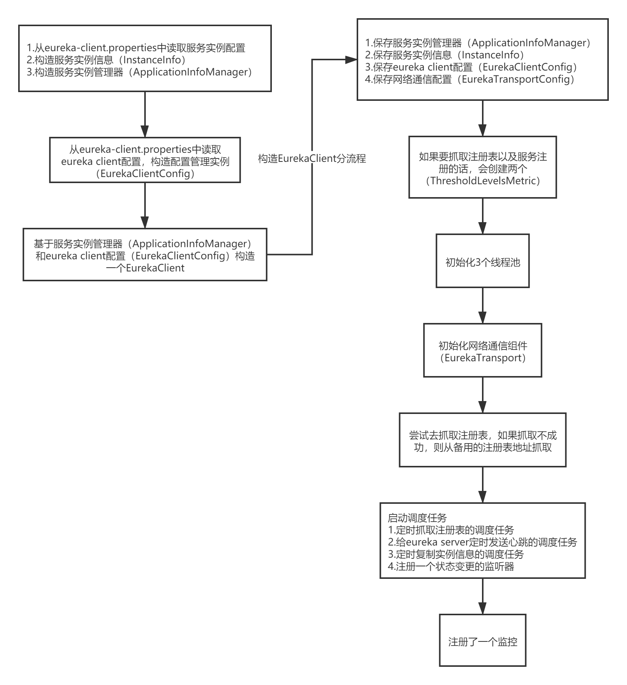
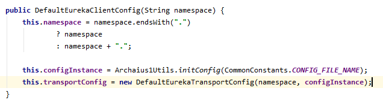
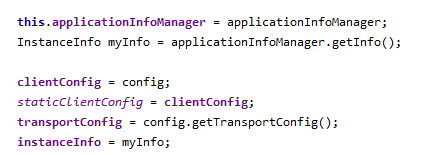
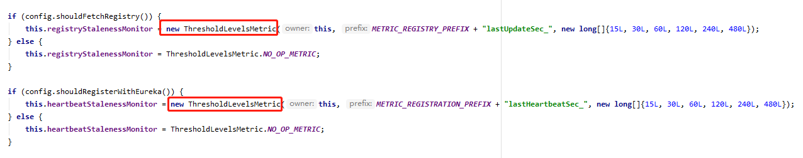
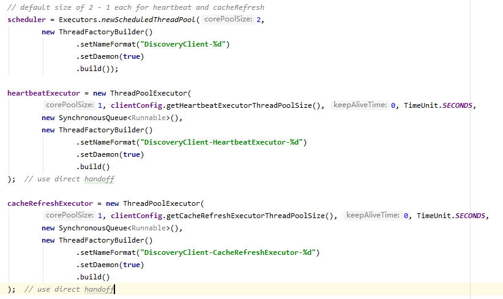
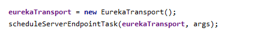
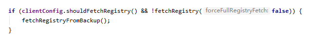

# eureka client启动



### 1.构造服务实例信息

1. 从eureka-client.properties文件中读取服务实例配置，构造服务实例配置管理器（EurekaInstanceConfig）

   ```
   new MyDataCenterInstanceConfig()
   ```

2. 构造服务实例信息（InstanceInfo）

   initializeApplicationInfoManager()；方法中，基于EurekaInstanceConfig，构造InstanceInfo实例对象

3. 构造服务实例管理器（ApplicationInfoManager）

   基于服务实例配置管理器（EurekaInstanceConfig）和服务实例信息（InstanceInfo），构造了服务实例管理器（ApplicationInfoManager）

### 2.构造Eureka Client配置管理器

​	从eureka-client.properties中读取eureka client配置，构造配置管理实例（EurekaClientConfig）



### 3.构造EurekaClient实例

​	基于服务实例管理器（ApplicationInfoManager）和eureka client配置（EurekaClientConfig）进行构造EurekaClient

1. 保存配置信息

   1. 保存服务实例管理器（ApplicationInfoManager）

   2. 保存服务实例信息（InstanceInfo）

   3. 保存eureka client配置（EurekaClientConfig）

   4. 保存网络通信配置（EurekaTransportConfig）



2. 如果要抓取注册表以及服务注册的话，会创建两个（ThresholdLevelsMetric）



3. 初始化3个线程池



4. 初始化网络通信组件（EurekaTransport）



5. 尝试去抓取注册表，如果抓取不成功，则从备用的注册表地址抓取



6. 执行initScheduledTasks()方法，启动调度任务

   1. 定时抓取注册表的调度任务
   2. 给eureka server定时发送心跳的调度任务

   3. 定时复制实例信息的调度任务

   4. 注册一个状态变更的监听器

7. 注册了一个监控（Monitors.registerObject(this);）

