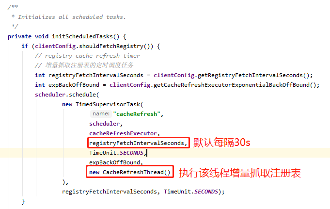
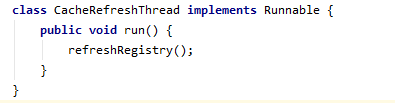
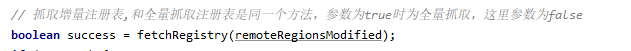
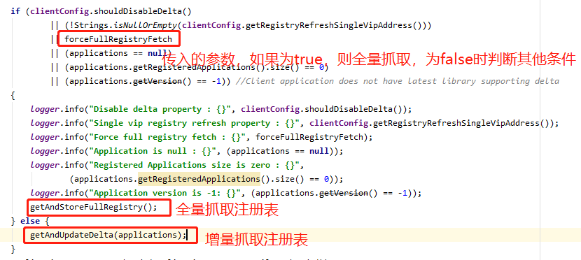
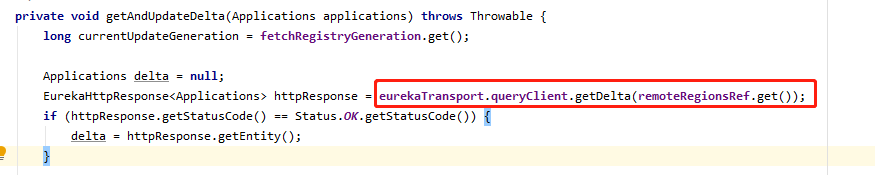

# Eureka Client每隔30s增量抓取注册表

## 一、Eureka Client

###### 1. Eureka Client启动的时候，会抓取一次全量的注册表，然后同时会启动一个定时调度的线程，每隔30s会发送一次http请求到Eureka Server增量抓取注册表。

###### 2. 定时任务执行的线程中，执行了refreshRegistry()方法。

###### 3. refreshRegistry()方法中最终执行fetchRegistry(false)方法来增量抓取注册表。

###### 4. fetchRegistry()方法中，最终调用了getAndUpdateDelta()方法。

###### 5. getAndUpdateDelta()方法中，通过EurekaHttpClient的getDelta()方法，获取增量注册表，方法中调用了Eureka Server中的http接口GET请求：http://localhost:8080/eureka/v2/apps/delta

## 二、Eureka Server

