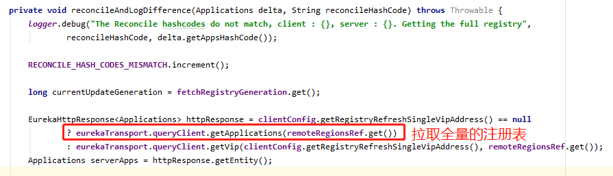

# Eureka Client每隔30s增量抓取注册表


## 一、Eureka Client

###### 1. Eureka Client启动的时候，会抓取一次全量的注册表，然后同时会启动一个定时调度的线程，每隔30s会发送一次http请求到Eureka Server增量抓取注册表。


###### 2. 定时任务执行的线程中，执行了refreshRegistry()方法。


###### 3. refreshRegistry()方法中最终执行fetchRegistry(false)方法来增量抓取注册表。


###### 4. fetchRegistry()方法中，最终调用了getAndUpdateDelta()方法。


###### 5. getAndUpdateDelta()方法中，通过EurekaHttpClient的getDelta()方法，获取增量注册表，方法中调用了Eureka Server中的http接口GET请求：http://localhost:8080/eureka/v2/apps/delta


###### 6. getAndUpdateDelta()方法中，通过http调用Eureka Server接口，获取到增量的注册表之后。如果增量注册表为null，则去获取一次全量的注册表。如果增量的注册表不为null，则去合并本地的注册表，完成服务注册表中服务实例的增删改。


###### 7. 抓取增量的注册表接口返回结果中，会带有一个Eureka Server端的全量注册表的hash值，此时Eureka Client端合并完成的注册表也会计算一个hash值。两个hash值进行一个比对，如果hash值不一样，则说明Eureka Client端的注册表与Eureka Server端全量的注册表不一样了，此时会从Eureka Server端重新拉去全量的注册表，更新到Eureka Client缓存中去。（一致性hash比对机制）





## 二、Eureka Server

```
Eureka Server设计的两个闪光点：
1.增量数据的设计思路。
	1).基于LinkedQueue，将每次变更的数据放入队列中。
	2).后台创建一个定时任务，每隔一定时间，将队列中存放超过一定时间的数据移除掉，保证队列中为最近几分钟内变更的增量数据。
2.数据同步时的一致性hash比对机制。
	1).在分布式系统中，进行数据同步时，采用hash值的思想，从一个地方计算一个hash值，到另一个地方，再计算一个hash值，保证两个hash值时一样的，确保数据传输过程中没有出现差异。
```


1. Eureka Client通过调用http://localhost:8080/eureka/v2/apps/delta接口获取增量的注册表，该接口对应eureka-core的resources目录下的ApplicationsResource类中的getContainerDifferential()方法。


2. 与抓取全量注册表时一样，这里获取增量注册表时，也会走多级缓存，也是调用responseCache.get(cacheKey)，去获取增量的注册表。

   区别是：获取全量注册表时，cacheKey中参数为ALL_APPS。获取增量注册表时，cacheKey中的参数为ALL_APPS_DELTA。

   


3. 与抓取全量注册表不同的地方，在初始化readWriteCacheMap时，对不同的cacheKey做了不同的处理。


4. 当cacheKey=ALL_APPS时，调用的是registry.getApplications()获取全量注册表。

   当cacheKey=ALL_APPS_DELTA时，调用的是registry.getApplicationDeltasFromMultipleRegions()获取增量的注册表。


5. 在registry.getApplicationDeltasFromMultipleRegions()，会去recentlyChangedQueue队列中获取增量的注册表。


6. recentlyChangedQueue队列，代表的含义是最近180秒内有变化的服务实例，比如新注册、下线什么的。

   在Registry构造的时候，会创建一个定时调度的任务，默认是每30秒执行一次，看一下recentlyChangedQueue中有没有停留超过了180s（默认）的服务实例，如果有就移除掉，保证recentlyChangedQueue中只存放最近180s内有变更的服务实例。

   


7. 上述步骤拿到了最近180s内有变更的服务实例，其实也就是增量的注册表。返回到Eureka Client服务中去做相应的处理。

