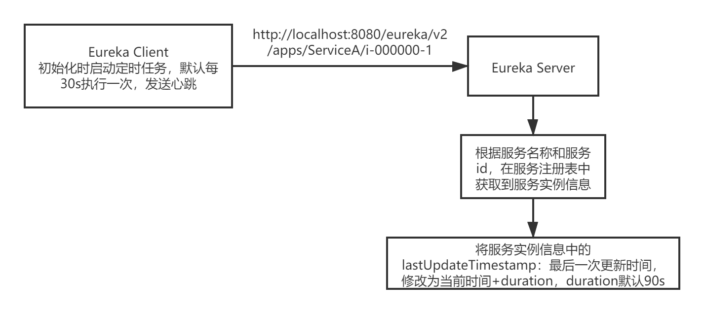
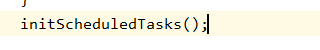
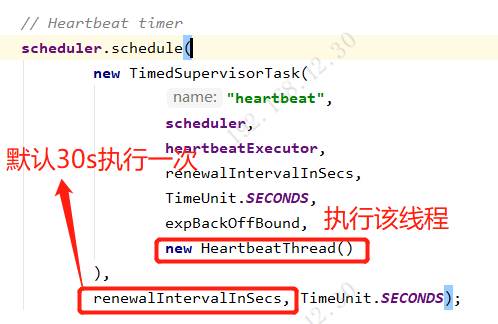
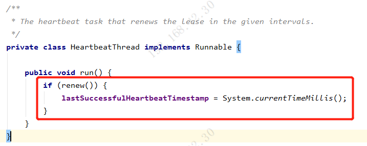
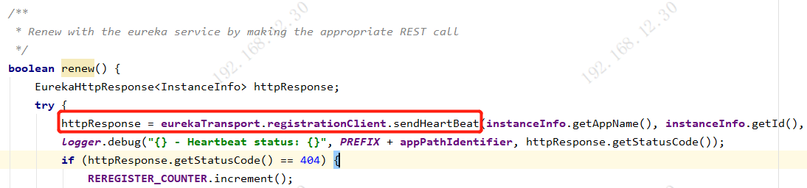
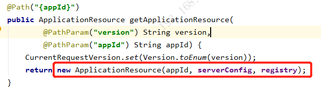
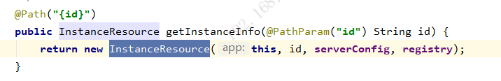
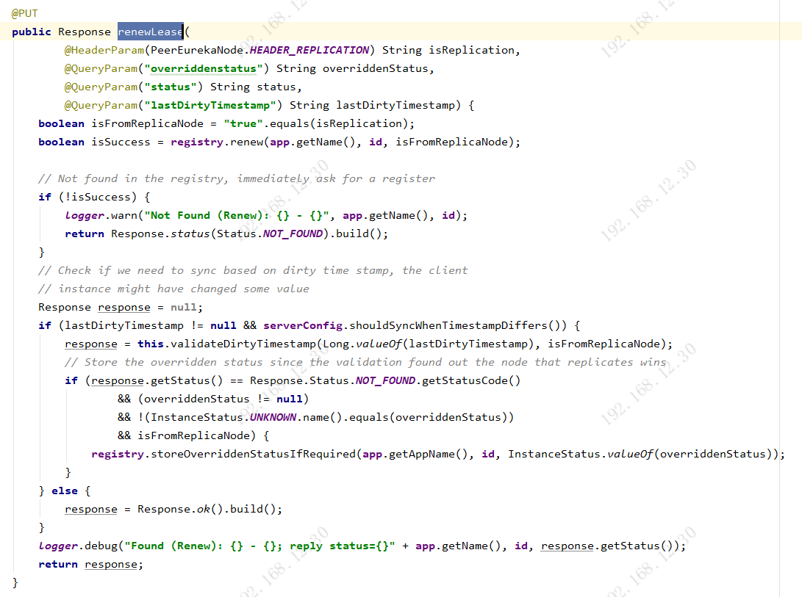
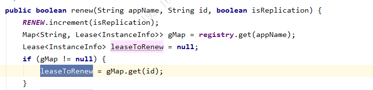
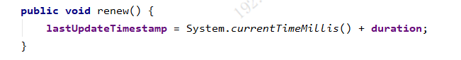

# Eureka心跳机制

## 一、Eureka Client发送心跳

###### 1.Eureka Client初始化的时候，会初始化定时任务

###### 2.初始化定时任务时，会开启心跳HeartbeatThread线程的定时任务，默认30s执行一次。

###### 3.HeartbeatThread线程中，执行renew()方法后，更新最后一次心跳时间lastSuccessfulHeartbeatTimestamp为当前时间

###### 4.renew()方法中，通过EurekaHttpClient调用Eureka Server的接口发送心跳。执行PUT请求，路径为：http://localhost:8080/eureka/v2/apps/ServiceA/i-000000-1

## 二、Eureka Server接收心跳

###### 1.http://localhost:8080/eureka/v2/apps/ServiceA/i-000000-1请求实际发送到eureka-core包下resources目录下的ApplicationsResource中的getApplicationResource()方法,方法中会创建一个ApplicationResource对象

###### 2.创建ApplicationResource对象会访问getInstanceInfo()方法，这是jersey框架的机制，这里不做深究。然后创建一个InstanceResource对象

###### 3.最终PUT请求在InstanceResource对象中，执行renewLease()方法

###### 4.最核心的是执行registry.renew()，registry是PeerAwareInstanceRegistry类型的对象，最终会执行它的父类AbstractInstanceRegistry中的renew()方法

###### 5.renew()方法中，首先通过服务名称和服务id，从注册表中获取服务实例的信息leaseToRenew

###### 6.执行leaseToRenew.renew()方法，方法中将服务实例信息中的lastUpdateTimestamp最后一次更新时间修改为当前时间+duration，duration默认90s

