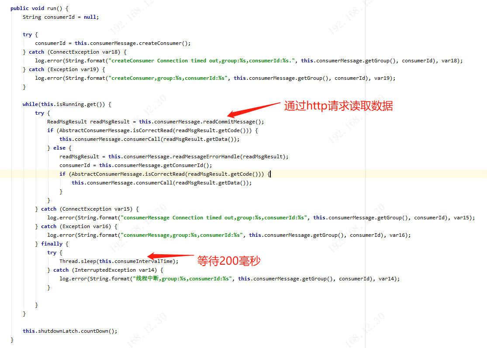

## 一、问题发现

**业务：**萤石云摄像头拍照后，自动识别车牌后，企业方创建监听器client，接收车牌识别结果(绑定摄像头编码)并入库。业务方通过摄像头编码读取该车牌识别结果。

**问题：**原服务应用单台机器部署，读取结果后存入redis缓存，业务方读取缓存后使用。

1. 后续迁入微服务后，集群部署应用，相当于多个监听器同时监听入库，导致数据大批量重复。
2. 服务内存占用过高，和数据存在延迟入库的问题（原因是数据高峰时期，数据处理过慢。导致的数据堆积，故存在延迟，具体问题后续源码分析过程中解释）

## 二、思考过程及解决方案

#### 问题1：

- **最初想到两种方案：**
  1. 在应用集群中，每台应用都启动一个监听器，在读取到数据时，
     1. 第一步：根据数据内容进行加锁，
     2. 第二步：入库时添加再唯一性校验。
  2. 在集群部署应用时，只在一台服务器上启动监听器。
     1. 添加一个分布式锁，服务启动时，监听器启动前，拿到锁就启动监听器，拿不到就放弃
     2. 在监听器中添加一个监听器正常状态的缓存，给予过期时间，定期更新缓存状态为正常
     3. 添加一个定时任务，在集群调度时，检测监听器的状态，如果正常则跳过，如果检测不到监听器的状态值，则表示监听器挂了，则启动一个新的监听器
- **两种方案的优劣对比：**（最终选用方案1）
  - 方案1：
    - 优点：保证了服务的高可用，避免单台服务挂掉导致数据丢失
    - 缺点：相同的数据做了重复的业务处理，消耗系统性能
  - 方案2：
    - 优点：节约资源，保证单台服务进行监听，不会有重复的数据处理
    - 缺点：在服务切换的过程中，会造成短暂的数据丢失

#### 问题2：

- 将对数据处理的业务代码抽离，接收到读取的数据后，将数据信息发送到mq中，对消息进行转发。然后另外监听mq消息进行处理，将消息的堆积转移到mq中，避免堆积到业务代码中，导致服务异常

## 三、源码分析

1. 业务方创建并启动监听器

   

   1. 启动一个线程
   2. 创建一个线程池，并创建一个计数器
   3. 初始化客户端，并设置回调的业务实现
   4. 启动监听，并通过CountDownLatch计数器阻塞当前线程（由于当前线程是一直阻塞的，所以不适合使用线程池来启用当前线程，会占用线程池中的一个线程资源，这里暂没有修改掉）

2. 初始化客户端过程刨析

   1. 初始化客户端时调用EzvizOpenClientBuilder.init()方法，在init()方法中，会初始化一个client，执行间隔时间此处默认传入200

      

   2. new EzvizOpenClient()的过程中，主要是对各种属性进行赋值

      

3. 启动监听器过程刨析

   1. 调用EzvizOpenClientBuilder.start()启动监听, 启动client

      

   2. 创建实例信息，并设置实例的回调实现（步骤4），然后调用consumerMessage.initClient()初始化实例信息（步骤5）

      

4. 实例的回调实现刨析

   1. 创建一个任务，传参msg回调的业务数据，messageCallBack业务执行逻辑，intervalTime执行间隔时间；执行该任务

      

   2. 创建任务，就是对MessageReceivedTask中的属性进行赋值

      

   3. 执行任务，message为List<Object>类型，遍历该数组，最终执行业务方的实现方法中

      

   

5. consumerMessage.initClient()初始化实例信息刨析

   1. 创建监听器读取业务数据的线程，并执行该线程

      

   2. 创建数据监听线程

      

   3. 通过http请求读取数据，每隔200毫秒执行一次

      

   4. AbstractConsumerMessage.readCommitMessage()方法执行，通过client调用http请求

      